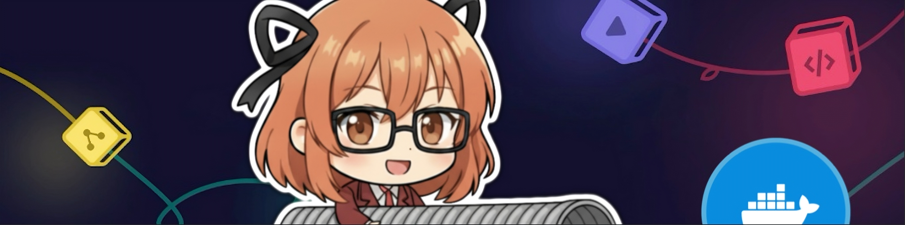
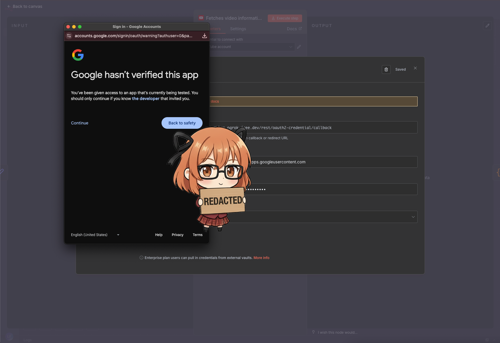
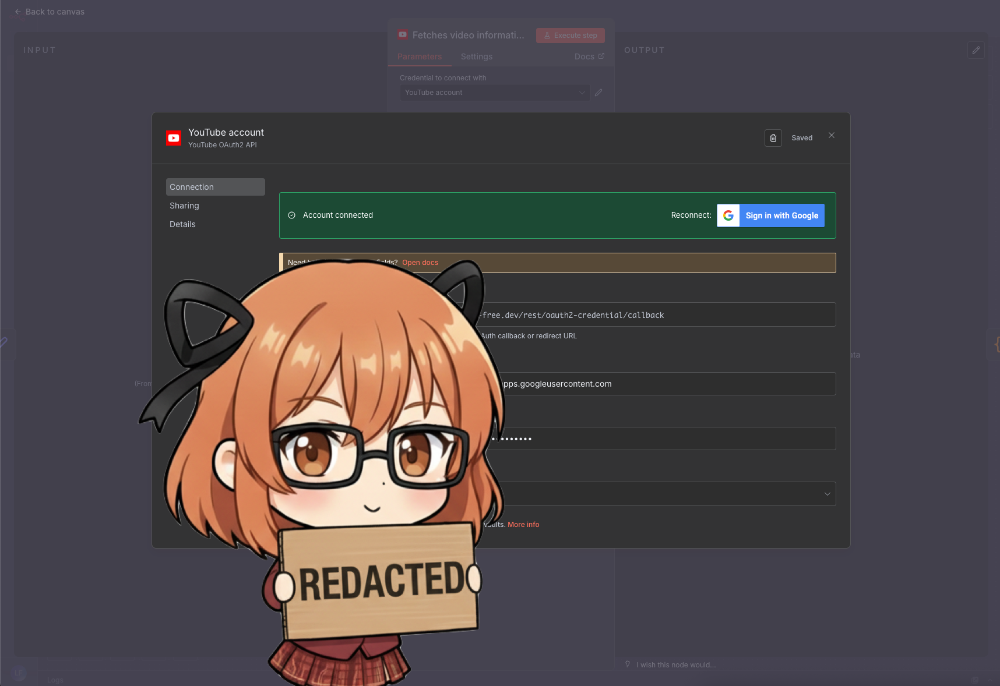

<!-- Source: https://medium.com/@mister.funable/running-n8n-locally-with-ngrok-734af69e1530 -->
<!-- Published: 2025-10-27T03:24:44 -->
# Running N8N Locally with Ngrok

<!-- Image Source: https://miro.medium.com/1*PepZalI-33SY1gYaRgL8eQ.png | Local: images/01/img-01.png -->


If you've made it past the basics of N8N, this guide will show you how to run it locally and make it accessible via a public URL using a tunnel service like **Ngrok**. I'll assume you're on MacOS (adjust accordingly for other systems).

## The Problem

When running N8N locally, some services require callback URLs or webhooks. Simply using `localhost` won't work for these cases. Also, opening standard ports like 443 can be tricky with some ISPs, which may prevent you from using your own domain.

**Solution:** Use a tunnel service to expose your local instance via a public domain.

## Step 1: Install Ngrok

Sign up for a free Ngrok account [here](https://ngrok.com/) (no credit card required), follow the [instructions for the setup](https://dashboard.ngrok.com/get-started/setup/macos):

```typescript
brew install ngrok
```

Register your authentication token:

```csharp
ngrok config add-authtoken <your_auth_token>
```

---

## Step 2: Configure Your Domain

Ngrok provides a free subdomain. You can view it [here](https://dashboard.ngrok.com/domains).

Example subdomain:

```bash
https://shark-mentallity-randomwords.ngrok-free.dev
```

Update your `.env` for Docker Compose:

```ini
DOMAIN_NAME=ngrok-free.dev
SUBDOMAIN=shark-mentallity-randomwords
```

---

## Step 3: Update Docker Compose

Traefik is not needed for this setup, as Ngrok will handle the public URL. A simple configuration might look like this:

```bash
services:
  n8n:
    image: docker.n8n.io/n8nio/n8n
    restart: always
    ports:
      - "127.0.0.1:5678:5678"
    labels:
      - traefik.enable=false
    environment:
      - N8N_ENFORCE_SETTINGS_FILE_PERMISSIONS=true
      - N8N_HOST=${SUBDOMAIN}.${DOMAIN_NAME}
      - N8N_PORT=5678
      - N8N_PROTOCOL=https
      - N8N_RUNNERS_ENABLED=true
      - NODE_ENV=production
      - WEBHOOK_URL=https://${SUBDOMAIN}.${DOMAIN_NAME}/
      - GENERIC_TIMEZONE=${GENERIC_TIMEZONE}
      - TZ=${GENERIC_TIMEZONE}
    volumes:
      - n8n_data:/home/node/.n8n
      - ./local-files:/files

volumes:
  n8n_data:
```

Make sure the ports are mapped correctly.

---

## Step 4: Run and Test

Start your Docker Compose setup, and visit your Ngrok URL in a browser. Your local N8N instance should now be accessible publicly, including webhook and callback endpoints.

<!-- Image Source: https://miro.medium.com/1*JZAFG7X_hAii_6nd7Iw1lQ.png | Local: images/01/img-02.png -->


<!-- Image Source: https://miro.medium.com/1*zfEy6nX7q0KIWMXAotX_7Q.png | Local: images/01/img-03.png -->


And that's it!

---

I wrote this guide as soon as I got it working, so only time will tell if it's a reliable long-term solution. Considering that N8N Cloud costs around $280 USD (Chilean price), the worst-case scenario with Ngrok would be paying $80 for the Hobby plan to maintain the tunnel.

Since it likely won't require heavy bandwidth, the free tier of Ngrok should be sufficient for most use cases before running out of credits.

If you know of a better solution, or if I missed something or got a detail wrong, please let me know!
