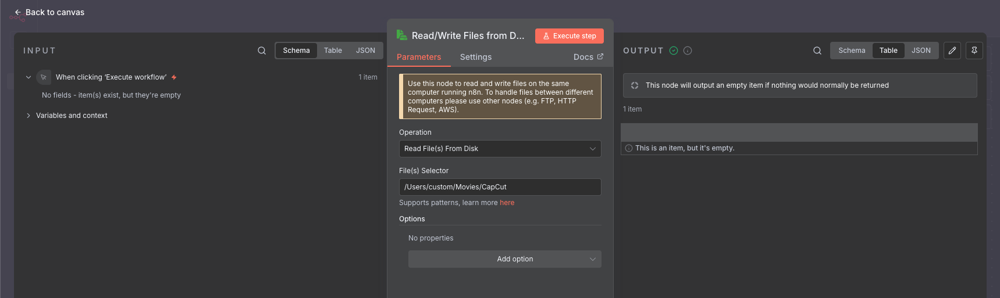
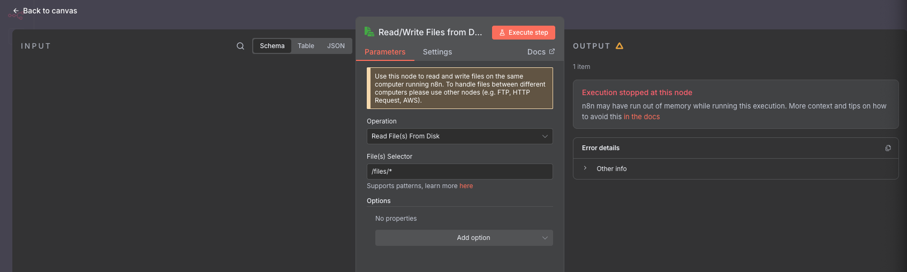

<!-- Source: https://medium.com/@mister.funable/how-not-to-work-with-local-files-in-n8n-8c4545a3f2b2 -->
<!-- Published: 2025-11-10T13:03:26 -->
# **How (Not) to Work with Local Files in N8N**

<!-- Image Source: https://miro.medium.com/1*koqq3Ew5pxyr6gvwTwyvdQ.png | Local: images/02/img-01.png -->


I was wondering if it was worth automating video uploads through n8n, so I decided to set up a quick test configuration.

<!-- Image Source: https://miro.medium.com/1*B968gCjQPOfjy1uR6hmNcA.png | Local: images/02/img-02.png -->


I used the **Read/Write Files from Disk** node to read the file path, but... right

<!-- Image Source: https://miro.medium.com/1*AzaRd4uSXuSlC5q5PzvqzA.png | Local: images/02/img-03.png -->


Right... I'm running this in Docker, so it needs to be mounted properly in the Docker Compose file:

```bash
services:

  n8n:
    image: docker.n8n.io/n8nio/n8n
    restart: always
    ports:
      - "127.0.0.1:5678:5678"
    labels:
      - traefik.enable=false
    environment:
      - N8N_ENFORCE_SETTINGS_FILE_PERMISSIONS=true
      - N8N_HOST=https://shawna-unopinionated-lochlan.ngrok-free.dev
      - N8N_PORT=5678
      - N8N_PROTOCOL=https
      - N8N_RUNNERS_ENABLED=true
      - NODE_ENV=production
      - WEBHOOK_URL=https://shawna-unopinionated-lochlan.ngrok-free.dev/
      - GENERIC_TIMEZONE=${GENERIC_TIMEZONE}
      - TZ=${GENERIC_TIMEZONE}
    volumes:
      - n8n_data:/home/node/.n8n
      - ./local-files:/files
      - /Users/custom/Movies/CapCut:/capcut

volumes:
  n8n_data:
  traefik_data:
```

At this point, it should have worked... tried again to read files:

<!-- Image Source: https://miro.medium.com/1*d2wFz-apCaqT16lEGcIUAw.png | Local: images/02/img-04.png -->


And crashed again, here is part of the output:

```bash
[+] Running 1/1
 ✔ Container n8n-compose-n8n-1  Recreated                                  0.2s
Attaching to n8n-1

(...) # Too many things here, skipping that

n8n-1 exited with code 137 (restarting)
```

The reason? Docker didn't have enough RAM. Turns out my local limit was 2 GB. Yeah, I'm cheap, bite me.

I increased the specs to the max to give Docker more breathing room... but nope, still no luck

I even tried doing the same thing, running the `ls` command directly from inside the container, after logging in with:

```bash
docker exec -it <container_name_or_id> /bin/sh
```

Same result.

After five minutes of googling (and a few sighs), I learned that Docker kind of _proxies_ files. So when you try to load several gigabytes through it, it crashes. Small stuff like config files or images? Totally fine. But big local files? Forget it.

And that was the end of my little experiment.

The main alternative seems to be using a cloud service like Google Drive or S3 and just passing files through there. Which works, but kind of defeats the purpose of doing it locally in the first place. Not exactly efficient.

Maybe this setup could still be handy for posting images to multiple social media accounts, though. That's probably worth trying next.

From what I understand, I'd need to handle some encoding/decoding between nodes to process files properly, but hey, I'll cross that bridge when I get to it.
