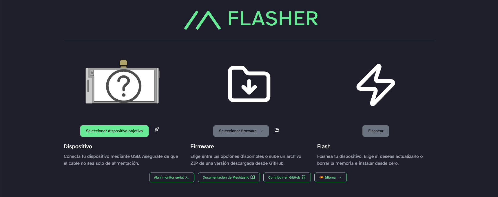
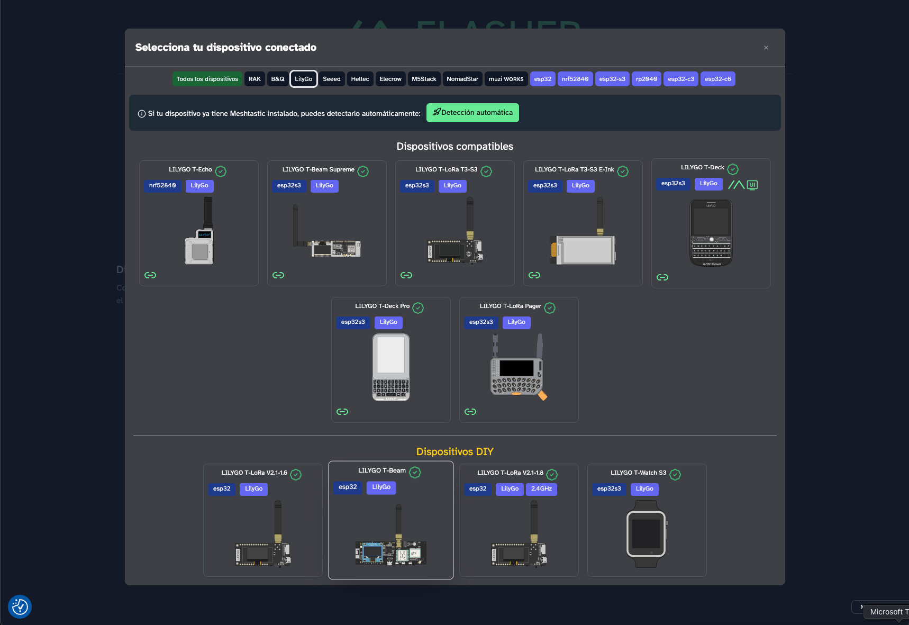
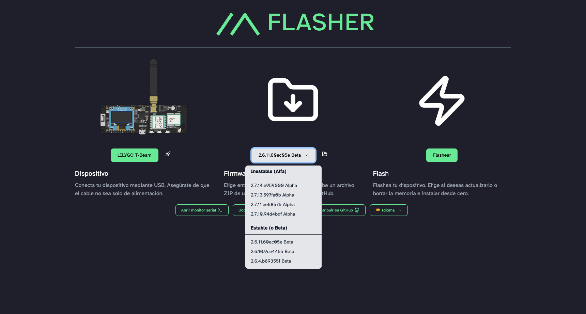
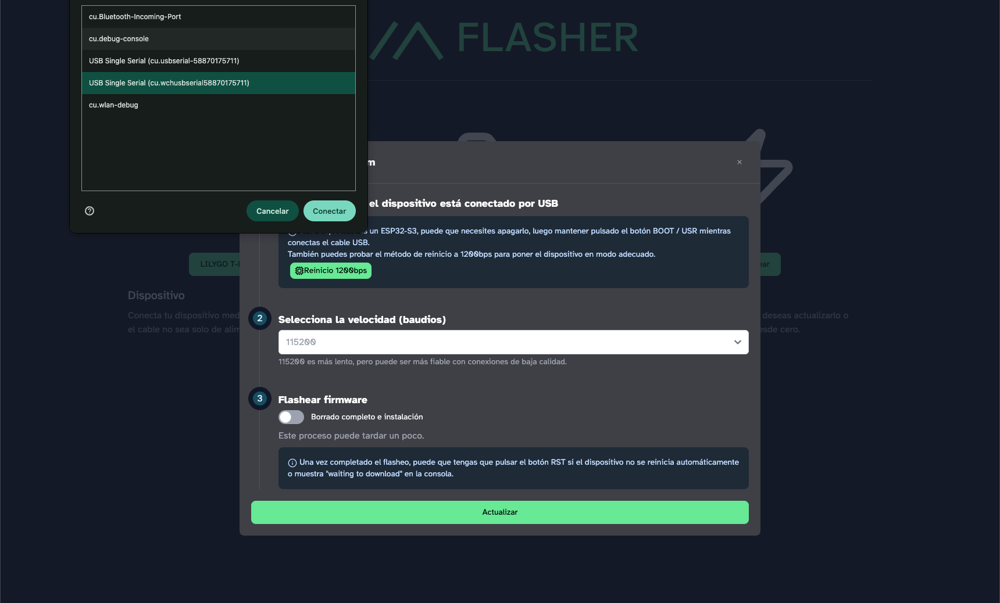
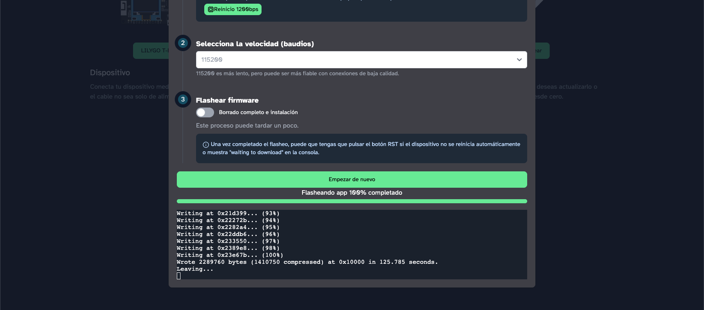

<!-- Source: https://radiohackers.com/getting-started-with-meshtastic-on-heltec-v3-and-lilygo-t-beam-e287f44df7b8 -->
<!-- Published: 2025-11-14T17:14:19 -->
# Getting Started with Meshtastic on Heltec V3 and LILYGO T-Beam

<!-- Image Source: https://miro.medium.com/1*FRsOzyuY0VMuN2xXRyWrIQ.png | Local: images/03/img-01.png -->

A friend gifted me a **Heltec V3**, and it immediately pulled me into the Meshtastic rabbit hole. The idea of mesh networks appeals to me. Communication that doesn't rely on cell towers or ISPs.

Not quite prepper territory, but having a backup option for emergencies (or just when you're somewhere with zero signal) seems pretty smart.

To play with these things, you need at least two devices so you can message between them and test stuff without bothering strangers on the long-range network. The Heltec was already configured, so I had to figure out how to flash one myself (not really that complicated, just scary at first).

There are plenty of tutorials online, but many are a bit longer than necessary. So here's a more concise guide to get your **LILYGO T-Beam** (or HELTEC V3) up and running using the Meshtastic Web Flasher.

## Flashing Time

Go to the [Flasher Web Meshtatic](https://flasher.meshtastic.org/) page.

<!-- Image Source: https://miro.medium.com/1*rUUmnThWmTUT94Qkbr3Qwg.png | Local: images/03/img-02.png -->

Select your device, in this case, LILYGO T-Beam.

<!-- Image Source: https://miro.medium.com/1*T2HLqeD3oyK98eNeCsSB6g.png | Local: images/03/img-03.png -->

I did confuse the T-Beam Supreme with my T-Beam (nothing else), so make sure to select the right one, otherwise it won't do anything.

As for the version, a stable version is fine, but if you're feeling kinky, then try a newer one. You can upgrade later by doing this same procedure.

<!-- Image Source: https://miro.medium.com/1*n_TO9HaO2p6ggIw0HaxQ-A.png | Local: images/03/img-04.png -->

Then Flash the device!

<!-- Image Source: https://miro.medium.com/1*cgMAdF7lrVN_cFGVinDtSw.png | Local: images/03/img-05.png -->

And now finally, flashing time! Except first:

- I don't recall what the **Restart 1200bps** option does, but it shows you the USB Serial. It should be `cu.wchusnserial123456` so you can see if the device is visible.

- I wouldn't touch the baud rate setting if I were you (no idea what it does).

- For the first setup, toggle the full wipe out so it makes a clean installation from scratch. For future updates/upgrades, **skip the full wipe** or you'll lose your information.

Hit the big green button and see the magic!

<!-- Image Source: https://miro.medium.com/1*62vkTaylgNkoYkSo6D6qnA.png | Local: images/03/img-06.png -->

If your device, like mine, doesn't have a screen, you'll be asked for a password. It's either 123456 or 123456789. Alternatively, you can check the serial information.

And now you're able to connect either from your phone or computer to your device. Heads up, the phone interface is cleaner.

**What's next?** Read the next post.

---

## What Those Settings Actually Mean

A few things I glossed over that are worth explaining:

- **Baud rate setting:** This controls how fast data is sent between your computer and the device (measured in symbols per second). The default setting works fine for flashing. You'd only need to change it if you're having connection issues, but that's rare.

- **Restart 1200bps option:** This forces the device into bootloader mode, making it ready to receive new firmware. It also shows you the USB Serial port name so you can confirm your computer sees the device. Useful for troubleshooting connection problems.

- **Version differences:** Stable versions are tested and reliable. Alpha/beta versions have newer features but might be buggy. Stick with stable unless you need a specific new feature and don't mind potential issues.

- **Default passwords:** After flashing, the device uses either 123456 or 123456789 as the default password. Different firmware versions or device models use different defaults. If one doesn't work, try the other. You can also check the serial output during boot to see which one it's expecting.
