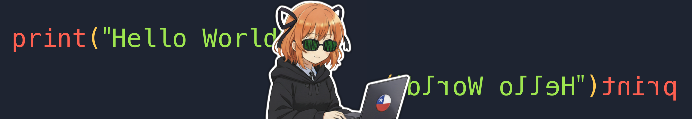

<!-- Source: https://medium.com/@mister.funable/setting-up-a-local-meshtastic-message-forwarder-c527bca2eb0e -->
<!-- Published: 2025-11-14T19:07:25 -->
# Setting Up a Local Meshtastic Message Forwarder

<!-- Image Source: https://miro.medium.com/1*wgq0vrSKYdKAtURprU7YJA.png | Local: images/05/img-01.png -->


After getting my Meshtastic devices running, I wanted to do more than just send messages through the app. The goal: set up a local forwarder that listens to a secondary channel and exports those messages. Basically, chat with myself in a private channel and see the messages show up in Python.

This is the foundation for later building something that can post and receive inputs from other services, but for now, let's start simple and get messages flowing locally.

### Why You'd Want This

A few reasons to forward Meshtastic messages programmatically:

- Log all messages from a specific channel

- Bridge messages to other services (Telegram, Discord, webhooks, whatever)

- Build custom notifications or alerts based on message content

- Test integrations without bothering the public mesh network

For this guide, we're keeping it local. Two devices (or one device chatting with itself), a secondary private channel, and a Python script listening to everything.

### What You'll Need

A few things before we start:

- At least one Meshtastic device (two is better for actual testing, but one works)

- Python 3 installed on your computer

- USB cable to connect device to computer (not all cables work for data, if it doesn't connect, try a different one)

- Basic command line comfort (you don't need to be a wizard, but you'll be running terminal commands)

### Step 1: Create a Secondary Private Channel

First, set up a private channel on your device(s). This keeps your test messages separate from the main public channel.

On your Meshtastic app:

- **Settings** > **Radio Configuration** > **Channels**

- Tap the **+** icon to add a new channel

- Name it something like "TestForward" or "PrivateChat"

- A Pre-Shared Key (PSK) gets generated automatically (this encrypts the channel)

- Hit **Save**

If you have two devices, share this channel:

- Tap **Share QR Code** in the channel settings

- Make sure only your new channel is selected (uncheck the others)

- Scan this QR code with your second device

Both devices now have access to this private channel. Messages sent here won't show up on the public mesh, which is exactly what we want for testing.

### Step 2: Install the Meshtastic Python Library

> **Important**: For this to work, your Meshtastic device needs to be connected directly to your computer via USB. We're not using Bluetooth or network connections here , just a physical USB cable to the device.

Connect one of your devices to your computer via USB. Power it on if it's not already.

Open a terminal and install the library:

```bash
pip install meshtastic
```

On a side note, I had issue with pip, so I installed `pipx` then `meshtastic`.

```bash
brew install pipx # If you don't use macOS, then Gl
pipx install meshtastic
```

Test that it can see your device:

```bash
meshtastic --info
```

```bash
# Output Example:

Connected to radio

Owner: Funable Radio (📻 )
My info: { "myNodeNum": 123456789, "rebootCount": 12, "minAppVersion": 30200 }
Metadata: { "firmwareVersion": "2.7.14.e959000", "deviceStateVersion": 24, "canShutdown": true, "hasWifi": true, "hasBluetooth": true, "positionFlags": 811, "hwModel": "TBEAM", "hasEthernet": false, "role": "CLIENT", "hasRemoteHardware": false }

Nodes in mesh: {
 (...) # Bunch of nodes here
}
```

You should see details about your connected device (node ID, firmware version, etc.). If you get an error, check your USB connection or try a different cable. Some cables only pass power and won't transfer data.

### Step 3: Write a Basic Message Listener

Here's where we get into code. Create a new file called `message_forwarder.py` and paste this in:

```python
import meshtastic
import meshtastic.serial_interface
from pubsub import pub

# This function gets called whenever a message is received
def onReceive(packet, interface):
    try:
        # Check if this is a text message
        if 'decoded' in packet and 'text' in packet['decoded']:
            message = packet['decoded']['text']
            sender = packet.get('fromId', 'Unknown')
            channel = packet.get('channel', 0)
            
            print(f"[Channel {channel}] {sender}: {message}")
            
            # Here's where you'd export/forward the message
            # For now, we're just printing it
            # Later: send to webhook, save to file, forward to Telegram, etc.
            
    except Exception as e:
        print(f"Error processing packet: {e}")

# Subscribe to message events
pub.subscribe(onReceive, "meshtastic.receive")

# Connect to the device via USB
print("Connecting to Meshtastic device...")
interface = meshtastic.serial_interface.SerialInterface()

print("Listening for messages... (Ctrl+C to stop)")
print("Send a message on your device to see it appear here.")

# Keep the script running
try:
    while True:
        pass
except KeyboardInterrupt:
    print("\nStopping listener...")
    interface.close()
```

This will listen to all conversations. Save this and run it:

```bash
python message_forwarder.py
```

If it connects successfully, you'll see:

```vbnet
Connecting to Meshtastic device...
Listening for messages... (Ctrl+C to stop)
Send a message on your device to see it appear here.
```

### Step 4: Test It Out

If everything's working, you should see new messages print in your terminal:

```bash
[Channel 0] !9e8e69e: 🛤 ️ !c12e456 🔴  | 📡 -141dB | 📶 -18.0dB | 🔗 Directo
```

That's it. You're now capturing messages programmatically. Not exciting visually, but this is the foundation for everything else.

### What You Can Do From Here

Now that you have messages coming into Python, you can do whatever you want with them.

- **Export to a file:**

```python
with open('messages.txt', 'a') as f:
    f.write(f"{sender}: {message}\n")
```

- **Filter by channel:**

```python
if channel == 1:  # Only process secondary channel
    # Do something
```

- **Forward to a webhook:**

```python
import requests
requests.post('https://your-webhook-url.com', json={
    'sender': sender,
    'message': message
})
```

- **Send to Telegram:**

```python
# (Requires python-telegram-bot library)
bot.send_message(chat_id=YOUR_CHAT_ID, text=message)
```

### Sending Messages Back From Python

You can also send messages from the script back to the mesh:

```python
interface.sendText("Hello from Python!", channelIndex=1)
```

This lets you build two-way integrations. Receive a message, process it, send a response. Like a bot that replies to commands.

### What's Next

This was just a quick test, but for the long run I will need to solve:

- **Multiple device handling**: If you want to connect multiple devices, you need separate serial interfaces for each one. Apparently it's one connection per device.

- **ID Translation**: I need to convert the IDs into names, so it's readable.

### The Full Picture (Eventually)

This is phase one: get messages flowing locally.

Phase two (future post): build a proper forwarder that:

- Listens to multiple channels

- Routes messages to different services based on content or sender

- Handles commands (send "!status" and get device info back)

- Logs everything to a database

But for now, this gets you started. You can chat with yourself in a private channel and see the messages in Python. From there, it's just a matter of connecting the pieces to whatever service you want.
