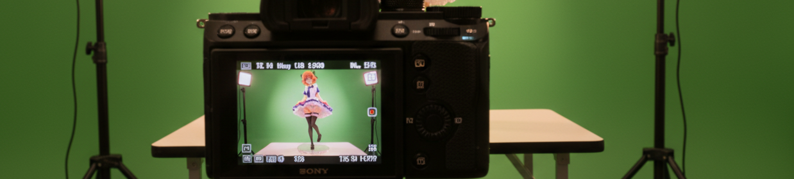
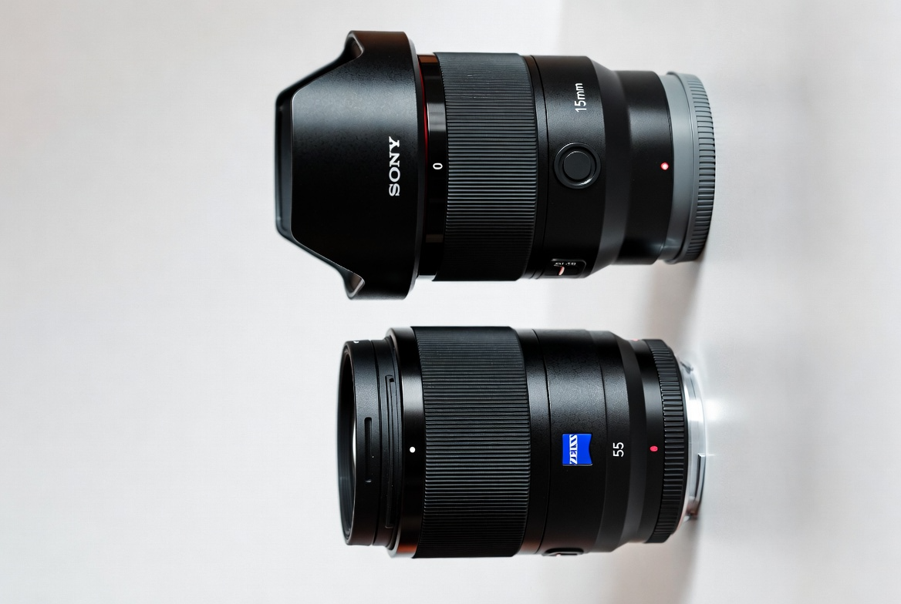
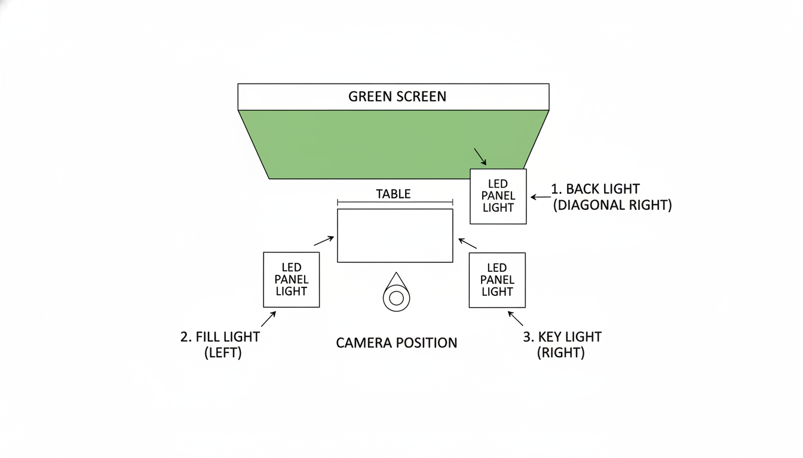

<!-- Source: https://medium.com/@mister.funable/sony-a6700-settings-for-unboxing-and-figure-videos-4ca3ddd4ecac -->
<!-- Published: 2025-11-17T01:53:09 -->
# Sony A6700 Settings for Unboxing and Figure Videos

I do unboxing videos and music videos of collectibles for fun. Nothing fancy, but I try to get as close as possible in quality to share them the way I see things.

<!-- Image Source: https://miro.medium.com/1*EbT89u3yhlp8YzH0tJliIw.png | Local: images/07/img-01.png -->

Getting the settings right on the A6700 has been a process of trial and error, so here's how I do it.

## What I Shoot

Most of the things and tricks I do happen during editing on CapCut, but getting the camera settings right makes that process a lot easier.

So I have these two categories:

1. **Spin/rotation videos** Close-up shots of figures rotating on a turntable. I want sharp details, nice _bokeh_ in the background.

2. **Hands-on videos:** Me unboxing things, showing details with my hands in frame. Need to capture the table surface and my hands without being too close.

If you've touched a professional camera or have the default lens that comes with the A6700, you're probably wondering, especially for the hands-on videos, how can I do this without putting the camera on my head? The answer is in the type of lens. I use one per category.

<!-- Image Source: https://miro.medium.com/1*NrY1Gkq18HMDQdCZGBYsvQ.png | Local: images/07/img-02.png -->

### Lens 1: Macro for Spin Videos - Zeiss T* FE 55mm f/1.8

This lens is great for those rotation videos where I want the figure sharp and the background blurred. The 55mm gives me that nice shallow depth of field.

**Settings I'm using:**

- **Frame Rate**: 60p

- **ISO**: 250

- **Aperture**: f/1.8 to f/2.8 (depending on how much I want in focus)

- **Focus Mode**: Continuous AF (AF-C)

- **Focus Area**: Center or Flexible Spot (depending on the figure size)

**The catch**: Minimum focus distance is 50cm. So I can't get super close, which means I need to position the turntable further back than I'd like sometimes. That's why it's not viable for unboxing. The next lens is the opposite.

**What works:**

- Lower ISO (250) keeps noise down

- 60p gives smooth rotation footage

- Manual aperture control lets me decide how much background blur I want

---

### Lens 2: Wide for Hands-On Videos - **Sony E 15mm f/1.4 G**

This is my go-to lens. I use it for everything where I need to show the table, my hands, and what I'm working on.

**Settings I'm using:**

- **Frame Rate**: 60p

- **ISO**: 250

- **Aperture**: f/1.4 (can't adjust it, more on that below)

- **Focus Mode**: Continuous AF (AF-C)

- **Focus Area**: Wide (to keep hands and objects in focus)

**The problem**: With AF-C enabled, this lens automatically adjusts aperture, and I can't manually control it. This causes the exposure to shift randomly, which creates inconsistent colors and sometimes introduces noise. I also used at the beginning black gloves, which messed up a lot the colors whenever my hands appeared on the screen.

**My workaround**: I use the Light Meter to set exposure limits. It's not perfect, but it prevents the camera from going too bright or too dark on its own.

**What I've noticed:**

- When aperture changes mid-recording, colors shift

- Sometimes the AF hunts and changes exposure while hunting

---

## Settings Summary

You can see my settings organized based on the camera menu [here](https://gist.github.com/MisterFunable/f0320daa0b9e3dc6ebb59682d420a7b5). For the short version, see below.

**General Settings:**

- **Video Format**: XAVC HS 4K

- **Frame Rate**: 60p

- **Record Setting**: 100M 4:2:2 10bit

- **Log Shooting**: On (S-Gamut3.Cine/S-LOG3)

- **LUT**: 709(800%)

- **ISO**: 250 (should probably be 800)

- **White Balance**: Custom 3, priority White

- **Zebra**: On at 75

**Macro Lens (Spin Videos):**

- **Aperture**: f/1.8 to f/2.8

- **Focus Mode**: AF-C

- **Focus Area**: Center/Flexible Spot

**Wide Lens (Hands-On):**

- **Aperture**: f/1.4 (auto-adjusted by lens)

- **Focus Mode**: AF-C

- **Focus Area**: Wide

- **Light Meter**: Enabled to limit exposure shifts

---

<!-- Image Source: https://miro.medium.com/1*QSIfk9huRrqOxhP0uKvZLw.png | Local: images/07/img-03.png -->

## My Lighting Setup

I use three LED panel lights **PL48**.

**Configuration:**

- **Main light**: Pointed at the green screen (behind the table)

- **Left light**: Positioned to the left of the table, slightly lower

- **Right light**: Positioned to the right of the table, slightly higher

**Why the height difference?** No idea. I tried them at the same height and it looked flat. Lowering the left one added some dimension and the colors looked better. Sometimes you just stumble into what works.

**Distance**: The table is 5cm from the green screen, which is too close but it's what fits in my space.

---

<!-- Image Source: https://miro.medium.com/1*ZXIOV21QSVrLblBZz2LGIQ.png | Local: images/07/img-04.png -->

## Post-Production Issues

Colors look fine on my monitor during editing. But after uploading to YouTube, they look dim.

**The problem**: my monitor shows things with a good brightness, but that doesn't translate to other devices.

**My workaround**: I adjusted my computer brightness to 40% and if the video looks bright, then it will look fine on YouTube.

There are other issues but that's for the next section!

---

## The Problems I'm Still Figuring Out

Now for the messy part. The settings above work, but there are issues I'm either ignoring or actively trying to fix.

### The Focus Issue I'm Ignoring

I keep focus on everything, but I really only need about 1/3 of the frame in focus. The table area where I'm working, basically.

I should probably switch to a narrower focus area and let the background (green screen) go soft. It would help with the green bounce problem too. I just haven't gotten around to testing it yet.

---

### The Noise Problem

I see noise in my recordings, especially in shadowed areas. In post-production (CapCut), I'm constantly:

- Increasing exposure

- Making blacks darker

- Using auto color at 25%

But then it creates other problems. Colors look oversaturated or the noise gets worse.

**What I think is happening:**

- The lighting looks good on the camera screen while shooting, but when I open the footage in CapCut, it's darker than I thought

- I'm shooting S-LOG3, which captures flat footage that needs proper exposure. But my ISO of 250 is too low

- The A6700 has dual base ISO at 800 and 2500, so shooting at 250 means the sensor isn't working at its optimal range

- I should bump ISO to 800 (the native base) and adjust my lights or use ND filters if it gets too bright

**Why I haven't changed it yet**: I'm cheap about buying ND filters or messing with my light setup. But I'll probably have to do it eventually.

---

### The Green Screen Problem

That's my background, and you have to be aware of a few things...

**Issues:**

- Green light bounces onto the figures and my hands

- During editing, the green gets into eyes and reflective surfaces

- I have to dim the green in post, which makes keying harder

**What helps:**

- Moving the table further from the green screen (more than the 5cm I currently have)

- Moving the lights away so it's more distributed

- Accepting that some green spill is unavoidable

- Using another background, like white or gray... but I don't want to change the green on the videos, is the only consistent thing, lol.

The closer the table is to the green screen, the worse the spill. But moving it back means I need to rearrange my lights and I'm lazy.

---

## Where I'm Headed

This setup isn't perfect, but it gives me usable footage. I'm trying to find a middle ground between good camera settings and improving my editing skills.

I could spend more on gear to get perfect footage out of the camera, or I could learn to fix things in post. I'm going with the second option because it's cheaper and I learn more. The noise, color issues, and green screen problems are all things I can work around in CapCut for now.

Probably no one cares about these small details as much as I do, but you know what they say, perfect is the enemy of good.

If you're doing similar content and found better solutions, let me know.
