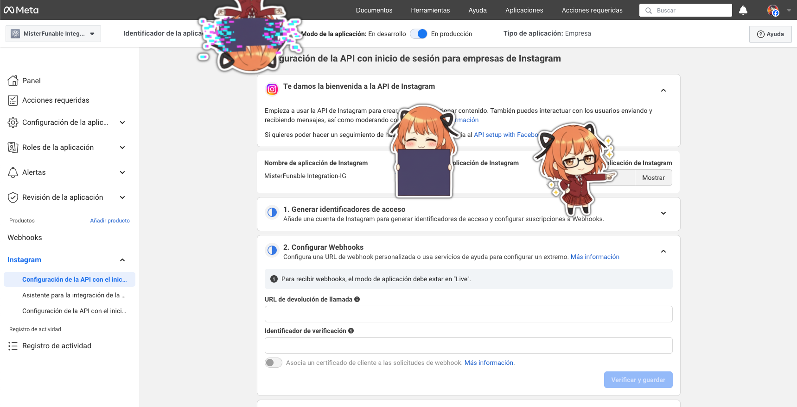

<!-- Source: https://medium.com/@mister.funable/getting-instagram-posts-with-n8n-the-simple-way-part-1-c66cb5217054 -->
<!-- Published: 2025-11-18T09:03:01 -->
# Getting Instagram Posts with N8N (The Simple Way Part 1)

So I wanted to automate sharing my Instagram posts on X through N8N. But the Meta Developer portal setup is confusing, luckily you only need to do the bare minimum if you're pulling data from your personal account.

<!-- Image Source: https://miro.medium.com/1*eFNrH9D5OsT_kKCbHzf2sg.png | Local: images/09/img-01.png -->


Thanks to this [Medium post](https://muhammadkasim.medium.com/fetch-account-media-using-instagram-api-5ab29c219ab3), that had the query I needed, turns out the basic setup is all you need. Here's the streamlined version.

## What You Need

- N8N running (local or cloud). If you have troubles running it on your computer check this [post](https://medium.com/@mister.funable/running-n8n-locally-with-ngrok-734af69e1530)

- An Instagram Business or Creator account connected to a Facebook Page

- A Meta Developer account (free)

- 10 minutes for initial setup

---

## Step 1: Minimal Meta Developer Setup

You need to create a Meta app and connect your Instagram account, but the good news is that you can skip all the OAuth callback configuration.

**Create the App**:

1. Go to [developers.facebook.com](https://developers.facebook.com/) and log in

2. Click **My Apps** → **Create App**

3. Select **Business type**

4. Give it a name like "**Instagram Automation**"

5. Click **Create App**

**Add Instagram**:

1. In the left sidebar, find **Add Product**

2. Find **Instagram** (not Instagram Basic Display as old posts say)

3. Click **Set Up**

4. Click **Add or Remove Instagram Business Accounts**

5. **Log in** and select your **Facebook Page** connected to **Instagram**

6. **Grant permissions**

That's it!

The Instagram API Settings menu should look like this:

<!-- Image Source: https://miro.medium.com/1*zhH_zloG0mIj6i1zhpnqDw.png | Local: images/09/img-02.png -->


You can stop there. Don't mess with callback URLs, redirect URIs, or any of that. The App token is all you need.

You can reveal it by clicking **Show/Mostrar**. It will ask for your password. After that, you'll be able to copy the token if you didn't catch it during creation.

---

## Step 2: Test Locally

Before building workflows, test that your token works. Save this as `test_instagram.sh` :

```bash
#!/bin/bash

# Replace with your actual token from N8N
TOKEN="your_access_token_here"

echo "=== Your Profile Info ==="
curl "https://graph.instagram.com/me?fields=id,username,media_count,account_type,followers_count&access_token=$TOKEN"

echo -e "\n\n=== Latest Posts ==="
curl "https://graph.instagram.com/me/media?fields=id,caption,media_url,media_type,timestamp,permalink&limit=5&access_token=$TOKEN"

echo -e "\n\n=== Last Post ==="
curl "https://graph.instagram.com/me/media?fields=id,caption,media_url,media_type,timestamp,permalink&limit=1&access_token=$TOKEN"
```

Run it:

```bash
chmod +x test_instagram.sh
./test_instagram.sh
```

If you see your Instagram data, you're good to go.

Check the next section for example outputs.

---

## Useful Queries

Here are other queries that could be useful to you:

### Get Your Profile Info

```bash
https://graph.instagram.com/me?fields=id,username,media_count,account_type,followers_count,follows_count&access_token=YOUR_TOKEN
```

```json
{
  "id": "1234567890",
  "username": "yourname",
  "media_count": 145,
  "account_type": "BUSINESS",
  "followers_count": 523,
  "follows_count": 312
}
```

### Get Latest Post (My Main Use Case)

```bash
https://graph.instagram.com/me/media?fields=id,caption,media_url,permalink,timestamp&limit=1&access_token=YOUR_TOKEN
```

```json
{
  "data": [
    {
      "id": "18012345678901234",
      "caption": "Check out this cool thing #photography",
      "media_url": "https://scontent.cdninstagram.com/v/...",
      "permalink": "https://www.instagram.com/p/ABC123/",
      "timestamp": "2024-01-15T10:30:00+0000"
    }
  ]
}
```

The permalink is what you share on X. The caption is your post text.

### Get Multiple Posts with Details

```bash
https://graph.instagram.com/me/media?fields=id,caption,media_url,media_type,timestamp,permalink,like_count,comments_count&limit=10&access_token=YOUR_TOKEN
```

```bash
{
  "data": [
    {
      "id": "18012345678901234",
      "caption": "New post!",
      "media_url": "https://...",
      "media_type": "IMAGE",
      "timestamp": "2024-01-15T10:30:00+0000",
      "permalink": "https://www.instagram.com/p/ABC123/",
      "like_count": 45,
      "comments_count": 3
    },
    ...
  ],
  "paging": {
    "next": "https://graph.instagram.com/v18.0/..."
  }
}
```

### Get Carousel Album Children

If you have posts with multiple images:

```bash
https://graph.instagram.com/me/media?fields=id,caption,media_type,children{media_url,media_type}&limit=5&access_token=YOUR_TOKEN
```

```json
{
  "data": [
    {
      "id": "18012345678901234",
      "caption": "Album post",
      "media_type": "CAROUSEL_ALBUM",
      "children": {
        "data": [
          {
            "media_url": "https://...",
            "media_type": "IMAGE"
          },
          {
            "media_url": "https://...",
            "media_type": "IMAGE"
          }
        ]
      }
    }
  ]
}
```

---

## Available Fields

Here's what you can request in the `fields` parameter:

**Profile fields** ( `/me`):

- `id`: Instagram user ID

- `username`: Instagram handle

- `account_type`: PERSONAL, BUSINESS, or CREATOR

- `media_count`: Total posts

- `followers_count`: Follower count (Business/Creator only)

- `follows_count`: Following count (Business/Creator only)

**Media fields** (`/me/media`):

- `id`: Media ID

- `caption`: Post caption

- `media_url`: Image/video URL

- `media_type`: IMAGE, VIDEO, or CAROUSEL_ALBUM

- `timestamp`: Post date (ISO 8601)

- `permalink`: Instagram post URL

- `like_count`: Number of likes (Business/Creator only)

- `comments_count`: Number of comments (Business/Creator only)

- `children`: For carousel albums

---

## Testing with Python

Create a file called `test_queries.py` to experiment with different queries:

```python
import requests
import json

TOKEN = "your_token_here"
BASE_URL = "https://graph.instagram.com"

def get_profile():
    url = f"{BASE_URL}/me"
    params = {
        "fields": "id,username,media_count,account_type,followers_count",
        "access_token": TOKEN
    }
    response = requests.get(url, params=params)
    return response.json()

def get_latest_post():
    url = f"{BASE_URL}/me/media"
    params = {
        "fields": "caption,permalink,media_url,timestamp",
        "limit": 1,
        "access_token": TOKEN
    }
    response = requests.get(url, params=params)
    return response.json()

def get_media_with_stats():
    url = f"{BASE_URL}/me/media"
    params = {
        "fields": "caption,permalink,like_count,comments_count,media_type",
        "limit": 10,
        "access_token": TOKEN
    }
    response = requests.get(url, params=params)
    return response.json()

if __name__ == "__main__":
    print("=== Profile ===")
    print(json.dumps(get_profile(), indent=2))
    
    print("\n=== Latest Post ===")
    print(json.dumps(get_latest_post(), indent=2))
    
    print("\n=== Recent Posts with Stats ===")
    print(json.dumps(get_media_with_stats(), indent=2))
```

Run it:

```typescript
python test_queries.py
```

This is basically the same as the Curl but you get the idea.

The code [here](https://gist.github.com/MisterFunable/4181aa797e03bcb806375d53cb5fea83) will allow you to see the output like appears below.

```bash
==================================================
Profile Details for: @yourname
==================================================
Account Type: BUSINESS
Total Posts: 145
Followers: 523
Following: 312
User ID: 1234567890

==================================================
Latest Post
==================================================
Type: IMAGE
Posted: January 15, 2024 at 10:30 AM
Caption: Check out this cool thing #photography
Link: https://www.instagram.com/p/ABC123/

==================================================
Recent Posts
==================================================

1. [IMAGE] - Jan 15, 2024
   Caption: Check out this cool thing #photography
   Likes: 45 | Comments: 3
   Link: https://www.instagram.com/p/ABC123/

2. [VIDEO] - Jan 12, 2024
   Caption: Quick video of my latest project...
   Likes: 67 | Comments: 8
   Link: https://www.instagram.com/p/DEF456/
```

## What's Next

Now that we have the query, it's time to HTTP the heck out of it! But that will be on the next post.

## Resources

- [Instagram Graph API Reference](https://developers.facebook.com/docs/instagram-api/reference/ig-user/media)

- [Original Medium post that helped me](https://muhammadkasim.medium.com/fetch-account-media-using-instagram-api-5ab29c219ab3) (uses the older Instagram Basic Display API, which is being deprecated)

- [N8N Instagram Integration Docs](https://docs.n8n.io/integrations/builtin/credentials/instagram/)
