<!-- Source: https://medium.com/@mister.funable/figma-body-alternatives-from-archetypes-to-art-b02c4a78390b -->
<!-- Published: 2025-11-19T23:02:07 -->
# Figma Body Alternatives: From Archetypes to... Art

Exchanging accessories between Figma figures is common. But what about swapping bodies? Are there alternatives to the standard Archetype She? Like, more... interesting bodies? Yes, and this post covers those options.

<!-- Image Source: https://myfigurecollection.net/picture/2034948&context%5B%5D=itemId%3A630253 -->
.](https://miro.medium.com/1*VdcqRL9Iphu-Cik1KP8KTg.png)

The artistic expression of the feminine form has been celebrated throughout history, from classical sculptures to modern photography. Now there are new ways to express and compose, and people out there sharing and making things worth admiring. This isn't something to be ashamed of. It's art.

> **TL:DR:** I only care about female bodies. Male bodies exist but won't be covered here.
Also, I'm blurring some pics because there is a place and time for everything.

---

## What Led Me Here

Bad decisions and alcohol, but besides that... [My Figure Collection (MFC)](https://myfigurecollection.net/), I love it! It's truly helpful to keep track of and find new products from many lines.

It also allows users to upload pictures and associate products with them, helping you discover pictures from figures that you own or are interested in.

And one of those pictures was this one:

<!-- Image Source: https://myfigurecollection.net/picture/2034948&context%5B%5D=itemId%3A630253 -->
 (login required). By [Kulizac](https://myfigurecollection.net/picture/2034948&context%5B%5D=itemId%3A630253).](https://miro.medium.com/1*NxO3lIuUrYatIwkgXLZ87g.png)

Yeah, a lot of NSFW bodies and multiple characters, some not directly Figma but you get the idea.

What brand were those? That question stayed in the back of my head for a few years. Until recently when talking with a friend, I gave it another try to find the picture and by extension the brand. You could say _I tried harder_.

In hindsight, I could have just clicked the associated products to see what they were. I probably overlooked this since some brands, especially the less official ones, aren't always in the database. But it turns out they were.

<!-- Image Source: https://miro.medium.com/1*SgqqEVxVhDb-QyOzUaA_uQ.png | Local: images/10/img-01.png -->
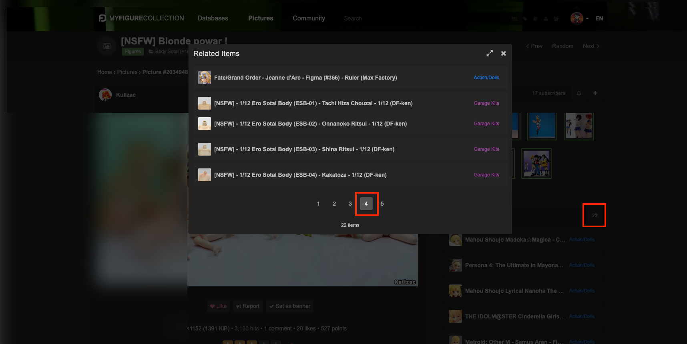

So why did it take me so long to continue my search? I diverted my attention to other figures and then discovered the **S-Style** line from **FREEing**. Thanks to this picture if my memory serves:

<!-- Image Source: https://myfigurecollection.net/picture/2279891&context%5B%5D=itemId%3A676262 -->
 by **R**odimus1138](https://miro.medium.com/1*-Rc4HtsA54CfYKV5HEwP9g.png)

Something more "official", 100% compatible with Figma body, and no articulations. A statue basically. Amazing!

I currently own over 160+ Figma figures ([check me on MFC](https://myfigurecollection.net/profile/MisterFunable)), so I think I'm relatively qualified to talk about this topic.

<!-- Image Source: https://miro.medium.com/1*eV17_baTxsWpNbJpBXSkIQ.png | Local: images/10/img-02.png -->
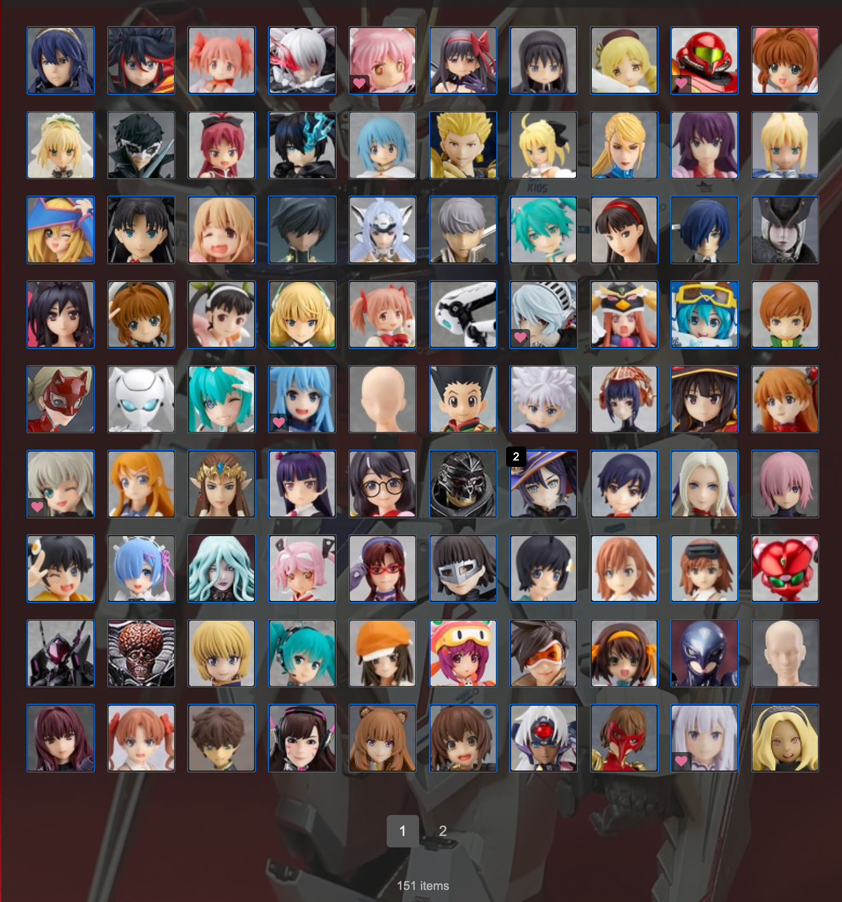

<!-- Image Source: https://miro.medium.com/1*cH7b1c03iE5jvH10Q8M6bg.png | Local: images/10/img-03.png -->
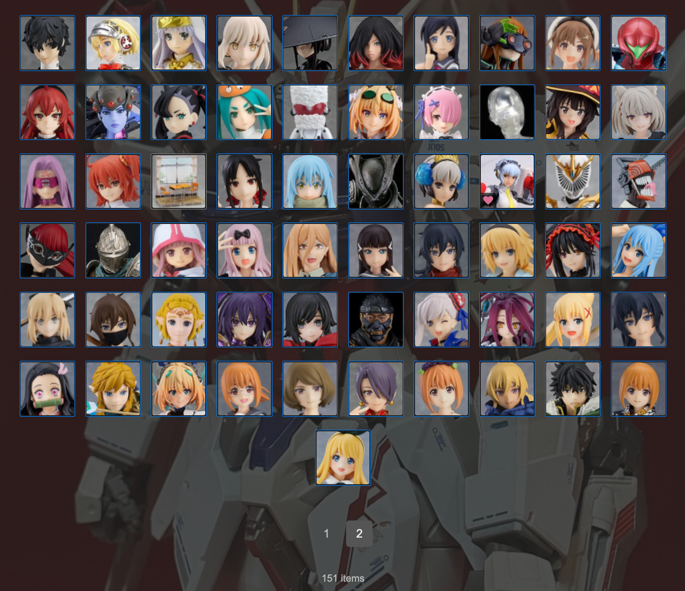

<!-- Image Source: https://miro.medium.com/1*dOzKMaQiPSM4UP3lAcyVwQ.png | Local: images/10/img-04.png -->
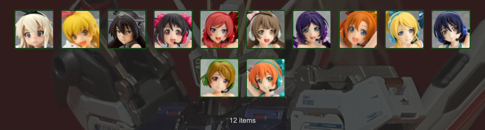

<!-- Image Source: https://miro.medium.com/1*uaVTBQiOFj2vcwZgHWqVTg.png | Local: images/10/img-05.png -->
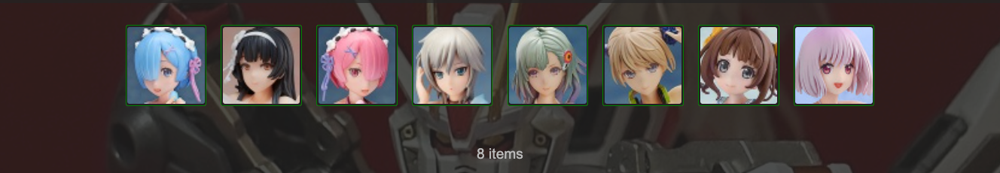

<!-- Image Source: https://miro.medium.com/1*OnBFcx3qq1_fn0QYD5EHhA.png | Local: images/10/img-06.png -->
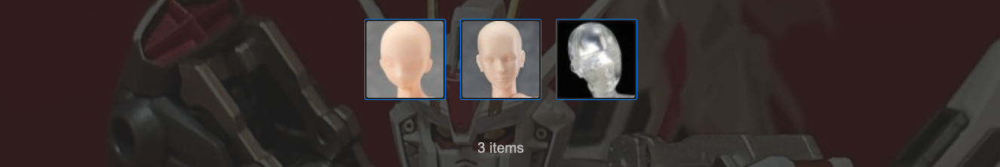

---

## Before We Dive In

### 1/12 Scale

Figma is not technically 1/12 scale. It's "kinda 1/12". That only means the sizes won't match perfectly between franchises since they prioritize proportions.

I personally divide them into these two categories:

- **Anime:** Similar proportions, but head/body dimensions vary by series. Parts are interchangeable, though some combinations look odd. Like a **Madoka Magica** head on a **Fate** figure.

- **Video Game:** Slim and long faces, more realistic than anime. **Persona**, **Fire Emblem**, **Zelda** figures fall here.

This matches the two types of Archetype bodies, so I'm not that crazy.

### Prices

Bodies can range from $20 to $100 USD (and even more), depending on the product line. Old discontinued products will be either too expensive or hard to find. If you find one at a good price, buy it.

I made a video about ["How to Buy Anime Figures](https://youtu.be/D4Pi0PO7iio?si=eXdshe5s50YVQhcV)" (in Spanish), one takeaway is you can use [BuyFinder](https://buyfinder.moe/) to search products by name, JAN, or MFC link ([example](https://myfigurecollection.net/item/118087)).

<!-- Image Source: https://buyfinder.moe/figure/actiondolls-figma-01-figma-archetype-she-flesh-color-ver-max-factory | Local: images/10/img-07.html -->
](https://miro.medium.com/1*fJvh5fm39SHb5O5hnOu1dw.png)

It checks 54 stores and shows original vs. current prices. Not something you'll use daily, but it prevents overpaying for some items.

---

> With that clear, let's move to the fun part!

---

## Articulated Bodies

We're skipping seamless doll bodies because that's a whole other thing.

### Figma Styles

<!-- Image Source: https://miro.medium.com/1*kzFZrxcIR-q9vBuOahcxWA.png | Local: images/10/img-08.png -->
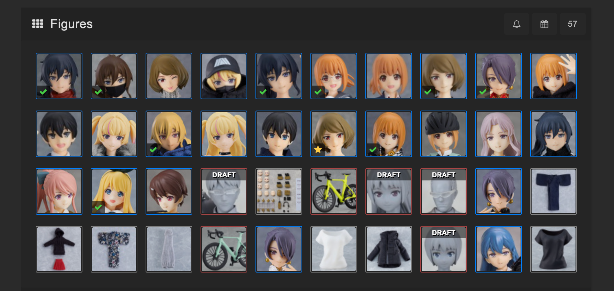

This [line](https://myfigurecollection.net/entry/187815) is two in one, a figure with clothes and sometimes accessories.

**Examples**: [Bikini Armor](https://myfigurecollection.net/item/806178), [Bride](https://myfigurecollection.net/item/795780) and [Sukeban](https://myfigurecollection.net/item/1131885).

<!-- Image Source: https://miro.medium.com/1*kIbZTyKNPZhBzn_vYMZMdg.png | Local: images/10/img-09.png -->
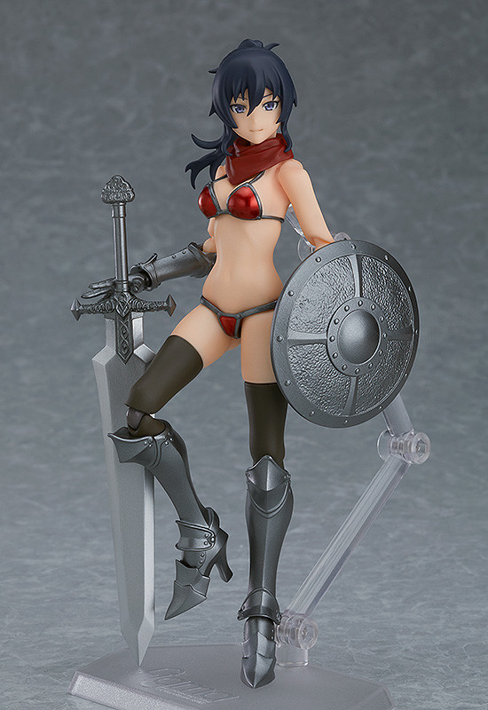

<!-- Image Source: https://miro.medium.com/1*Cxuj3fAGxpBlfTEYHLlskg.png | Local: images/10/img-10.png -->
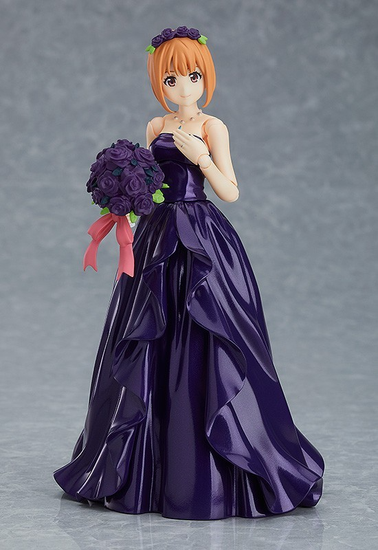

<!-- Image Source: https://miro.medium.com/1*HJ5tlEpLTqL2d2CTNvLf5A.png | Local: images/10/img-11.png -->

---

### Archetype and Archetype Next: She

<!-- Image Source: https://miro.medium.com/1*QnRd7ZxPdbCZepJX9gwy2w.png | Local: images/10/img-12.png -->
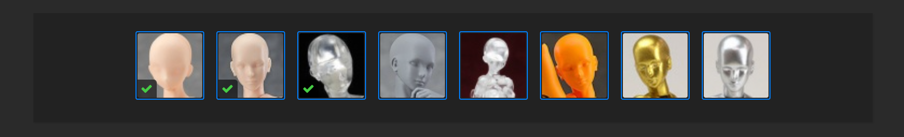

This [line](https://myfigurecollection.net/?keywords=figma+she&_tb=item) is what you should look for in base bodies, even though they don't have anatomical details. I personally prefer these for displaying weapons.

There are two sizes: [#01♀](https://myfigurecollection.net/item/118087), [#02♀](https://myfigurecollection.net/item/166981), and then color/transparent version called [#02♀ Next](https://myfigurecollection.net/item/166981)

<!-- Image Source: https://miro.medium.com/1*Qo-4f7JTU7GaAhR9JNamLg.png | Local: images/10/img-13.png -->
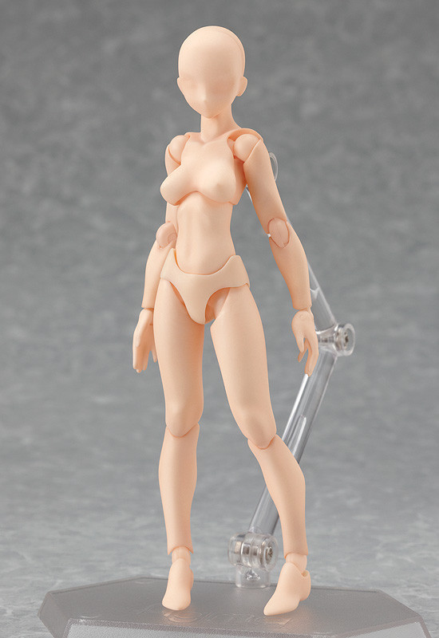

<!-- Image Source: https://miro.medium.com/1*-HJ4gwEwpTvU8LEp1wFTwg.png | Local: images/10/img-14.png -->
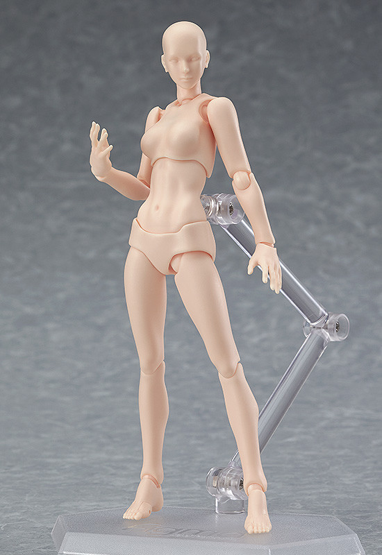

<!-- Image Source: https://miro.medium.com/1*NeY6LnlpEOlf6smuyexP-g.png | Local: images/10/img-15.png -->
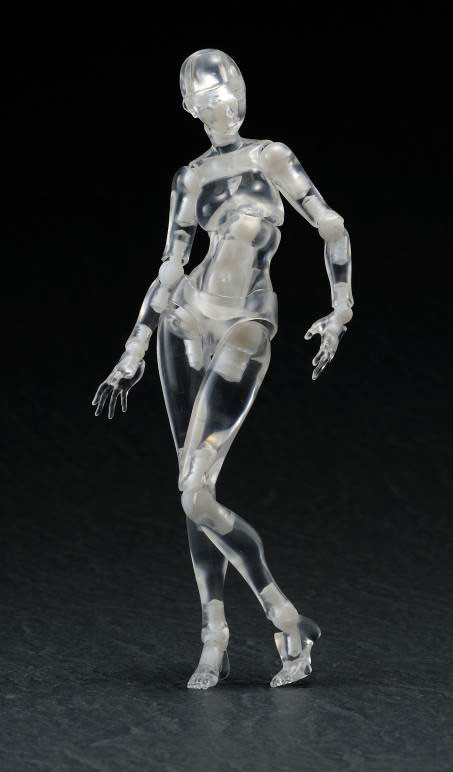

The size range isn't great, you get either #01♀ (smaller, anime proportions) or #02♀ (taller, realistic proportions). Nothing in between or above.

Now that I recall, [Mio (XC3)](https://myfigurecollection.net/item/1618550) was quite big, even for 02 standards.

---

### Bootleg Archetype

As with any bootleg/Knockoff, expect mold lines, less overall quality and some articulation issues. Good enough to experiment with.

<!-- Image Source: https://onesixthfigures.forumotion.com/t1336-figma-he-and-she-next-archetypes-bootleg-knockoff | Local: images/10/img-16.html -->
" post](https://miro.medium.com/0*9BeP5NlcSyUFo6Ca.jpg)

---

### Semi Seamless (AliExpress, Can't recall the brand)

These don't work with Figmas. They use ball-joint neck connections designed for doll heads, not Figma's peg system.

You'd need poster putty to make it work. Bad value too at $15, you're only saving $5 compared to a 1/6 scale body that's twice the size.

<!-- Image Source: https://miro.medium.com/1*ZgP7EXpvBLylKASSTeFNbA.png | Local: images/10/img-17.png -->
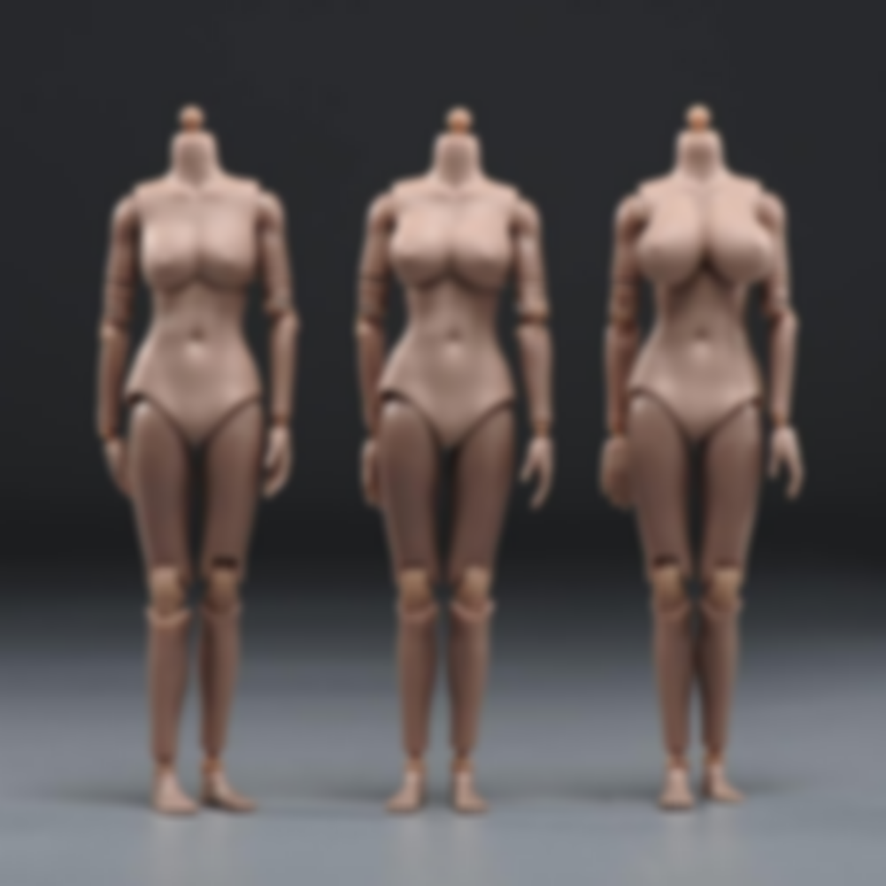

<!-- Image Source: https://miro.medium.com/1*NM5LFzVg1x0X5QRNF624ow.png | Local: images/10/img-18.png -->
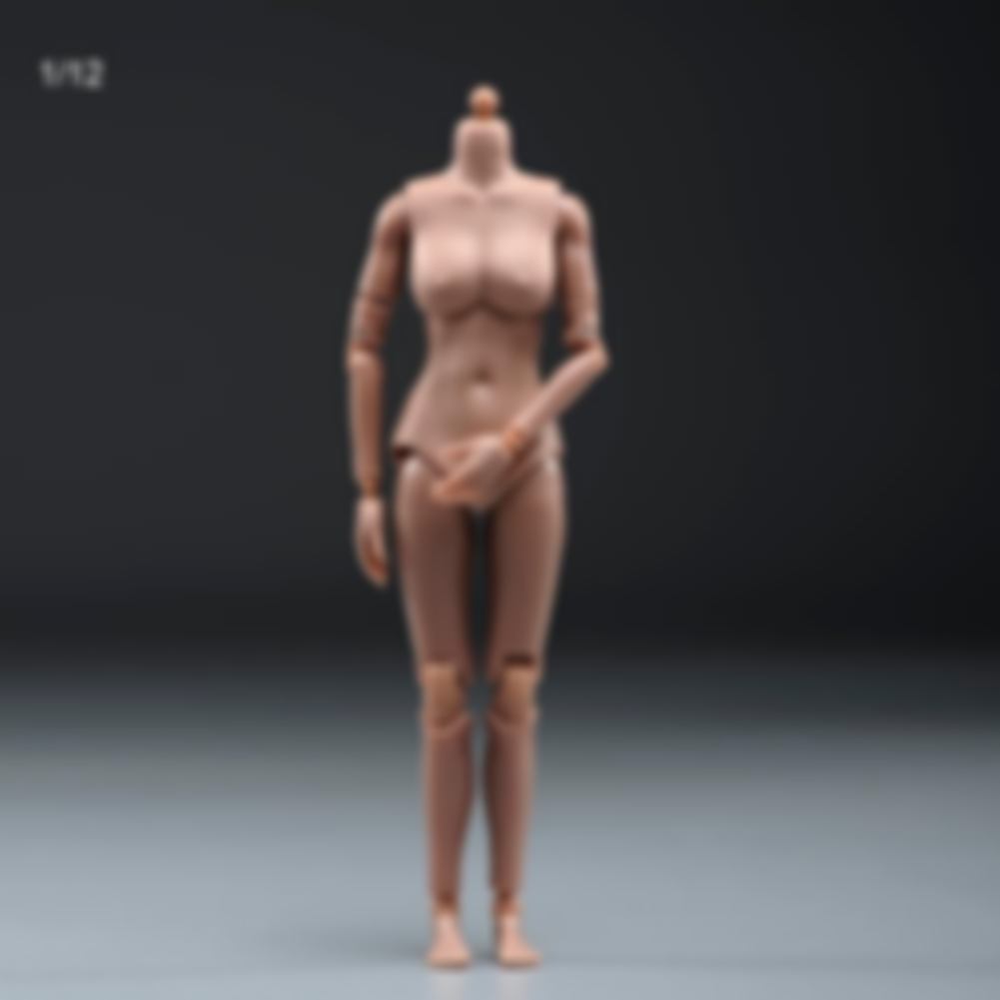

<!-- Image Source: https://miro.medium.com/1*RSK-y09ZB5XQlkplE3qWZA.png | Local: images/10/img-19.png -->
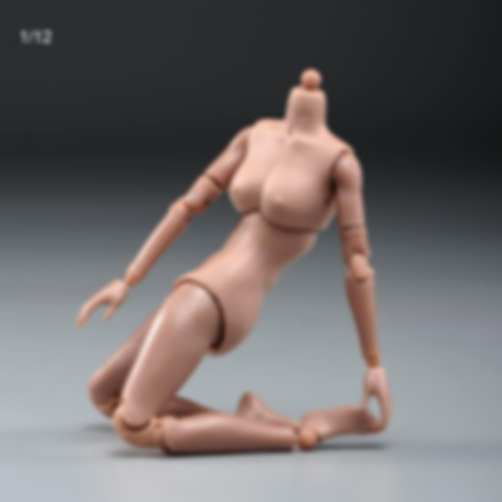

---

> Until this point, there aren't many options, but we're getting somewhere.

---

### The New Discovery: Premium Parts Collection

<!-- Image Source: https://miro.medium.com/1*jQR5OZJRUU0gN4f12lcFxg.png | Local: images/10/img-20.png -->
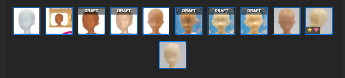

This [line](https://myfigurecollection.net/?current=title&title=PPC&rootId=0&orEntries%5B%5D=10211&_tb=item&mode=browse&tab=search&output=2&sort=insert&order=desc&year=2025&month=11&domainId=-1) (From [Hobby Base](https://myfigurecollection.net/entry/10211)) offers three body sizes: S (small), M (medium), and L (relatively tall). Last release was in 2022, so hopefully more are coming.

A friend shared this line with me which kickstarted my search for bodies with... anatomical details and the creation of this post. There's one at my local store (size L, brown), but that color is hard to pair with most heads. I'll still make a video about it.

Going back to the body, there are three body types, **S**, **M** and **L**:

<!-- Image Source: https://miro.medium.com/1*nd3XdEvXIzrc6IhCXX7mbw.png | Local: images/10/img-21.png -->
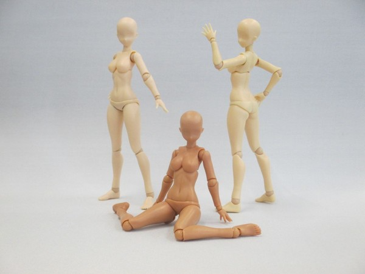

<!-- Image Source: https://miro.medium.com/1*ExGYL2-x6-TIEMsNWznT7g.png | Local: images/10/img-22.png -->
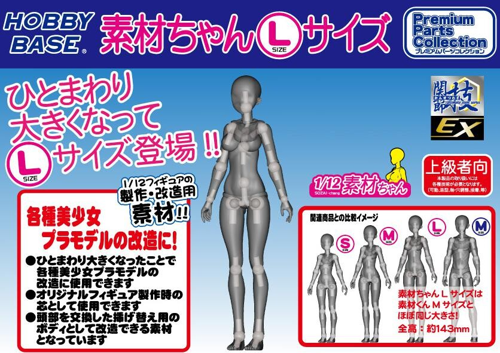

Checkout this [fantastic blog](http://blog.livedoor.jp/nobuno88/) covering them:

1. [Review Hobby Base 1/12 Material-chan S Light Fresh](http://blog.livedoor.jp/nobuno88/archives/1077982375.html)

2. [Review Hobby Base 1/12 Material-chan Fresh/Light Fresh](http://blog.livedoor.jp/nobuno88/archives/1077134148.html)

<!-- Image Source: http://blog.livedoor.jp/nobuno88/archives/1077982375.html | Local: images/10/img-23.html -->
 by Nobuno88](https://miro.medium.com/1*97YIeJRvurigMyLMGqHs-Q.png)

<!-- Image Source: https://miro.medium.com/1*wOUGX9PmNuBfdy6v55uvqQ.png | Local: images/10/img-24.png -->
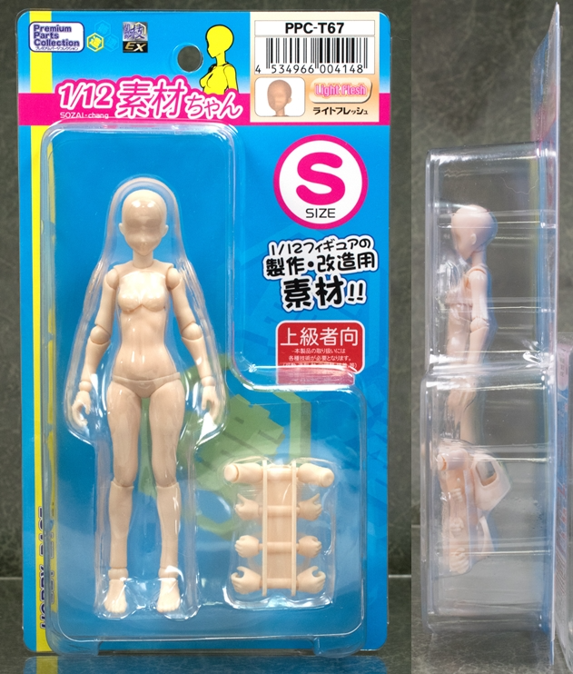

<!-- Image Source: https://miro.medium.com/1*tXAM4_kZPcGNhWD2xOh3Dw.png | Local: images/10/img-25.png -->
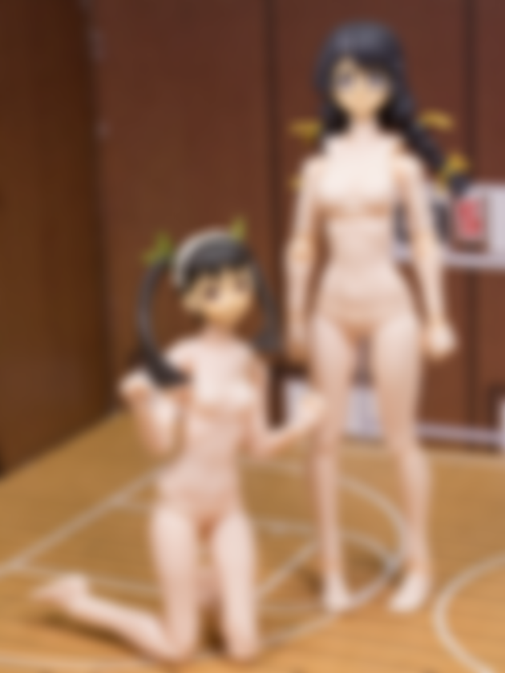

<!-- Image Source: http://blog.livedoor.jp/nobuno88/archives/1077982375.html | Local: images/10/img-23.html -->
" post](https://miro.medium.com/1*fWYU1Ne_VDp64OEp98NBDA.png)

## Fixed Bodies

### S-Style

<!-- Image Source: https://miro.medium.com/1*VDCqrCRE5Zf6v-WOs0fS4w.png | Local: images/10/img-26.png -->
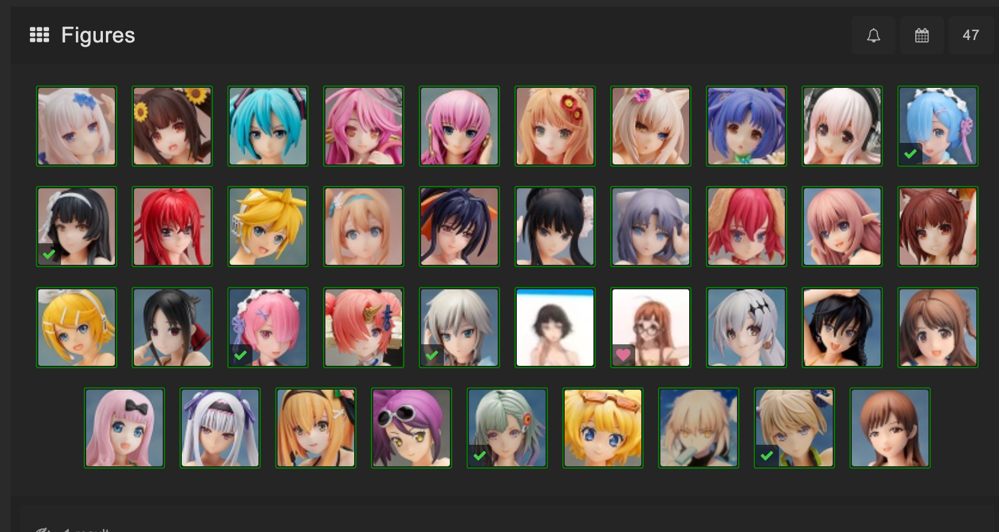

This [line](https://myfigurecollection.net/entry/95891) is a variant from the [Figma x Fixed x Figure (FigFix)](https://myfigurecollection.net/entry/69140) line but produced by [FREEing](https://myfigurecollection.net/entry/7633) that also produces other lines like [B-Style](https://myfigurecollection.net/entry/99284) and [Y-Style](https://myfigurecollection.net/entry/99283). Same size as Figmas, but more akin to statues. That's where the "fix" comes from, lol.

And the **S** in **S-Style** stands for **swimsuits**!

The problem? Prices are inconsistent and can get ridiculous. Some characters cost $50, others $100+. If you want a specific character in a bikini and there's no regular Figma version (like from Fate or Figma Styles), this is your option.

**Examples**: [Akane](https://myfigurecollection.net/item/958722), [Hinatsuru Ai](https://myfigurecollection.net/item/806278), [QBZ-95](https://myfigurecollection.net/item/740095)

<!-- Image Source: https://miro.medium.com/1*dtfLrVMCnEWCvZFVrH5iBA.png | Local: images/10/img-27.png -->
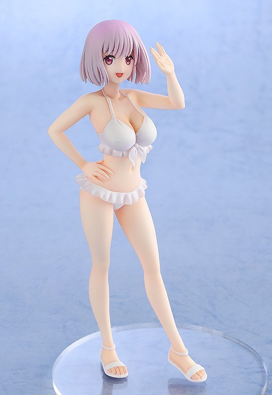

<!-- Image Source: https://miro.medium.com/1*6SrZVxb1iBAxLbRaYq2DZg.png | Local: images/10/img-28.png -->
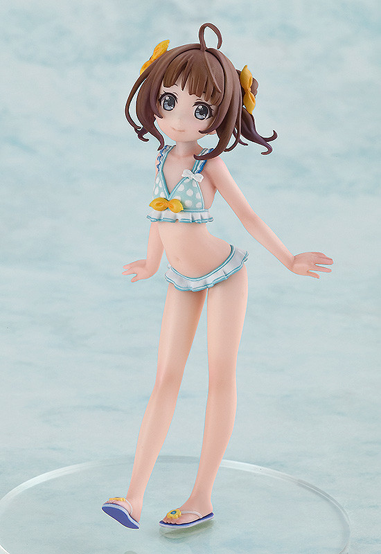

<!-- Image Source: https://miro.medium.com/1*nQPlfrknOm8Y-pbSw2YEjQ.png | Local: images/10/img-29.png -->
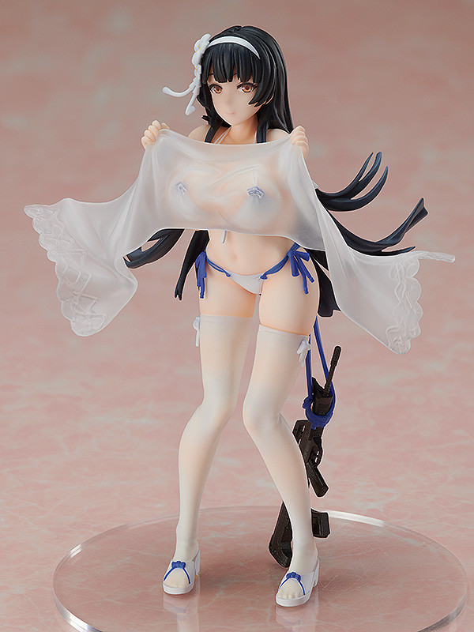

### 1/12 Ero Sotai Body

<!-- Image Source: https://miro.medium.com/1*9rTArai3J_h7-zgotto_mg.png | Local: images/10/img-30.png -->
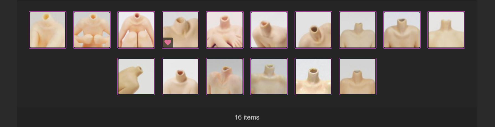

This [line](https://myfigurecollection.net/entry/138987) is what I was originally searching for. Like **S-Style** but without the **S**.

These are garage kits, so expect mold lines and some assembly required. For what you get, that's acceptable. The catch? Only available from their [official store](https://momoken.wonder-remix.jp/prdc_info.html), but as stated on their [shop](http://wonder-remix.shop-pro.jp/) they are no longer selling 1/12 figures 😭

**Examples**: [Tachi Hiza](https://myfigurecollection.net/item/630252), [Taiki Chuugoshii](https://myfigurecollection.net/item/630263), [Yuuwaku Sokugai](https://myfigurecollection.net/item/630262)

<!-- Image Source: https://miro.medium.com/1*1gdl_cPhguwf0W4kUK8ugA.png | Local: images/10/img-31.png -->
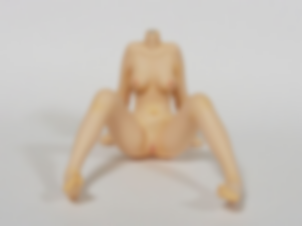

<!-- Image Source: https://miro.medium.com/1*W3COHc62gA_sX2LAm2z2GA.png | Local: images/10/img-32.png -->
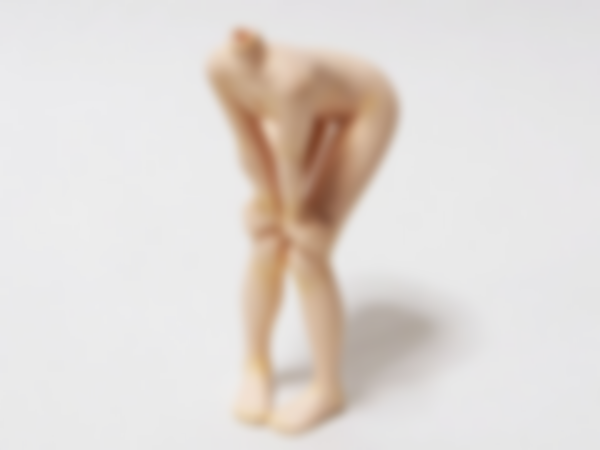

<!-- Image Source: https://miro.medium.com/1*p7bi1LaS9_csliOHeL920g.png | Local: images/10/img-33.png -->
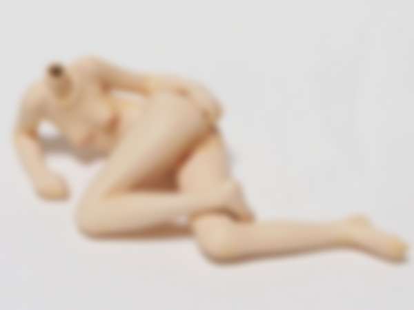

---

## Other mentions

Lines I'm aware of but haven't tested/checked compatibility:

## S.H.Figuarts Body-chan

<!-- Image Source: https://myfigurecollection.net/?current=title&title=Body-chan&rootId=0&orEntries%5B%5D=23382&_tb=item&mode=browse&tab=search&output=2&sort=insert&order=desc&year=2025&month=11&domainId=-1 -->
](https://miro.medium.com/1*Ja6Tj2dHdu5wcKhOM6aCnQ.png)

These work well with other Bandai lines like S.H. Figuarts. Figma compatibility is unclear. [Search here](https://myfigurecollection.net/item/572059) for compatibility examples.

### 86TOYS Female 1/12 Scale Semi-Seamless Action Figure Body

<!-- Image Source: https://miro.medium.com/1*c7Trz0sR1NJzpZWMI6JYQw.png | Local: images/10/img-34.png -->
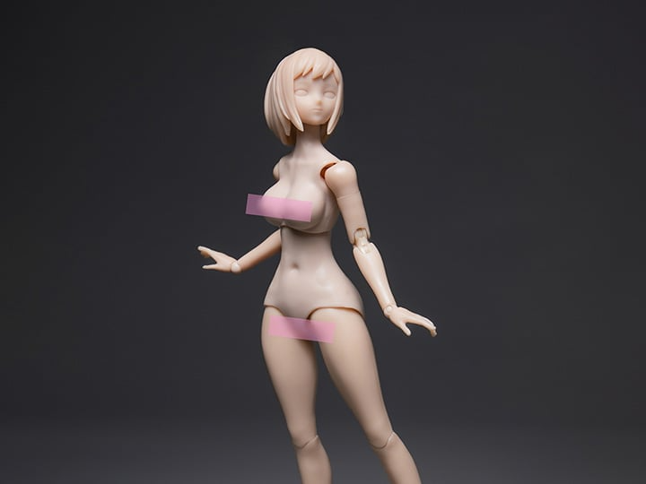

Looks decent quality-wise, but it's semi-seamless. Probably uses ball-joint connections like the AliExpress bodies, so same compatibility issues.

---

That covers the main body options available. I've wanted to write this guide for a while, and now I finally have all the info. There's a huge 1/12 world out there, but my next goal is getting one or more Ero Sotai Bodies.

If you know other brands, have corrections, or comments, let me know so I can improve this!

And if you've read this far, you deserve a [bonus section](https://medium.com/@mister.funable/figma-bodies-bonus-section-027b2243d5f7).
