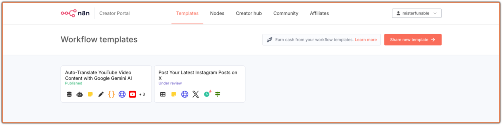
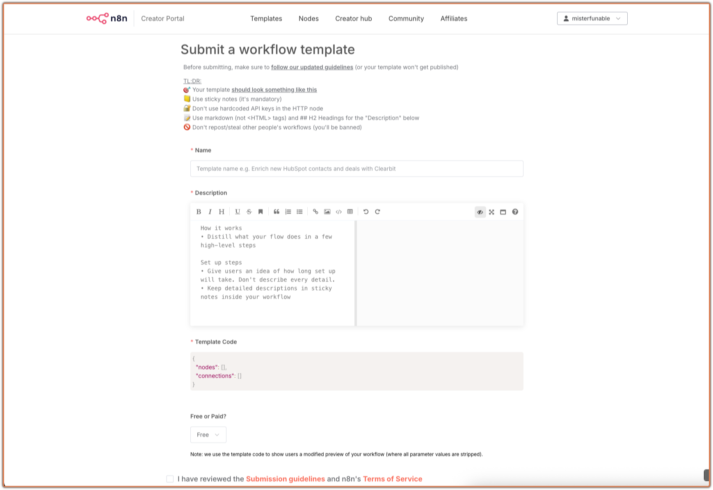
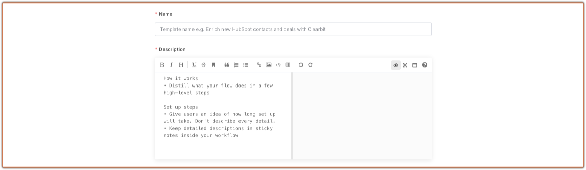
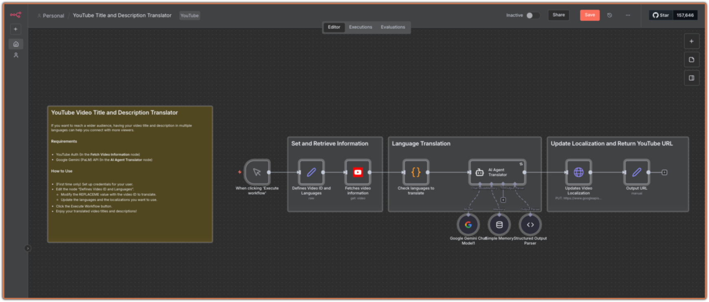
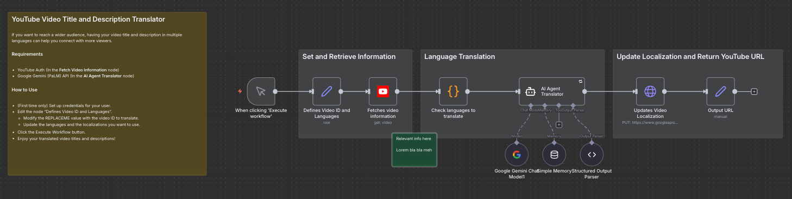

<!-- Source: https://medium.com/@mister.funable/how-to-publish-your-n8n-template-375832d8efd7 -->
<!-- Published: 2025-11-21T03:18:40 -->
# How to Publish Your n8n Template

I submitted a template a few months ago ([Auto-Translate YouTube Video Content with Google Gemini AI](https://n8n.io/workflows/9543-auto-translate-youtube-video-content-with-google-gemini-ai/)) and I'm currently doing the process again for the Share Instagram posts to X workflow. So it's a good time to write about how to share templates on n8n.

<!-- Image Source: https://miro.medium.com/1*4XdUIN5SvuiCV1lNlDWx_Q.png | Local: images/11/img-01.png -->

> The real reason for this post is that I keep losing the submission links, which I always come back to on the [Community questions](https://community.n8n.io/t/how-to-share-a-template-to-the-community/110729).

I'm assuming you already have a working workflow that's not present anywhere else and could be useful to others, so let's begin!

## The Links You Need

The [Creator Hub](https://n8n.notion.site/n8n-Creator-hub-7bd2cbe0fce0449198ecb23ff4a2f76f) has all the links, but no time for that:

- **[Register as an n8n creator](https://creators.n8n.io/register)**

- You now see the **[Creator Portal](https://creators.n8n.io/dashboard)**

Hurray! Let's move on.

---

## Submission Process

<!-- Image Source: https://miro.medium.com/1*MI8c0ZG2sIyH4GqIwYlsOQ.png | Local: images/11/img-02.png -->

Click **Share new template** in the Creator Portal and you will see the following:

<!-- Image Source: https://miro.medium.com/1*d7s_i3AXPPg8C3MdO8ASVA.png | Local: images/11/img-03.png -->

There will be a link to the [Template submission guidelines](https://n8n.notion.site/Template-submission-guidelines-9959894476734da3b402c90b124b1f77), read it.

Key takeaways from that:

- **Don't do low-effort work**. If you see that someone else can really benefit from it, do it. The worst they can say is no.

- **Your title has to be attractive and SEO friendly.** Try to phrase it in a way that people could find it while searching.

- **Follow the suggested sections**. Don't try to do them all, aim for what's useful and get to the point.

- **Rename your nodes to match the purpose** (now that I read this I forgot about it for the Instagram one).

- **Make it easy to follow for new and experienced members**.

- **Don't share your credentials please**. When you associate your credentials through an auth system, those are fine, but if you have like the HTTP Node with a hardcoded token in the URL or body, that's what you shouldn't do.

Now, let's walkthrough each section.

### Title and Description

<!-- Image Source: https://miro.medium.com/1*fCsdvjI1AtJGsJi8qV0Dzw.png | Local: images/11/img-04.png -->

Don't worry too much, just follow the guidelines as best as you can. Make it understandable and double check fluidity and grammar with an AI. This way you won't waste time on small mistakes, and the n8n team can focus on actual review feedback.

If they can suggest a better title or improvement, they will.

<!-- Image Source: https://miro.medium.com/1*xmxvQd6c1w4k_mi_uPVAJg.png | Local: images/11/img-05.png -->

For the template code, in your workflow screen you can either export it as JSON or just select everything and copy it.

<!-- Image Source: https://miro.medium.com/1*tJx8LQf-Nxt93rGnxMj0fg.png | Local: images/11/img-06.png -->

Paste it in the Template Code section, you will see a looong JSON, then you are good to go.

<!-- Image Source: https://miro.medium.com/1*CO2cgvveovIVLChT6HISOw.png | Local: images/11/img-07.png -->

Paid option is only available once you have submitted 3 templates. But in most cases it will be free.

Click the checkbox that you reviewed the [submission guidelines](https://n8n.notion.site/Template-submission-guidelines-9959894476734da3b402c90b124b1f77) (that you totally skipped by reading this), and **submit it**!

---

## Workflow Review

In a few hours or days, they'll reach out to you through email with feedback.

They won't scream at you. If you're making something ugly, they will politely show you more decent examples from what's available on [Workflows](https://n8n.io/workflows).

And if you're like me and didn't get it, they'll send you an example like this [one](https://n8n.io/workflows/8968-email-outreach-drafter-based-on-hubspot-data/).

It had mostly to do with sticky notes, so let's use my workflow:

<!-- Image Source: https://miro.medium.com/1*ROOUQNaWYzuV6LkFi3YEuw.png | Local: images/11/img-08.png -->

Sticky colors are not relevant for this, but I'll use them to differentiate the sticky note types:

- **Yellow**: Main sticky note.

- **White/Grey**: Section sticky notes.

- **Green**: Normal sticky note.

In short, here's what I learned:

1. The details that you write on the submission process don't necessarily have to be the same as the ones you add on the **main sticky note**. That one can be lengthy.

2. The **main sticky note** should be to the point: **Who's it for + What it does (high level)**, **How it works (steps)**, and **(optionally) How to use**. If you want to write your heart's content, do it on the template submission section. There may be templates where there's a lot of text, but that depends on the complexity and scale of the workflow.

3. Use **section sticky notes** as backgrounds to group sections with a relevant title, not for individual nodes. I used one color for the YouTube section, another for Discord, another for the code processing part. You get the idea. I like colorful things.

4. Name the nodes.

5. Include **normal sticky notes** for things to be aware of or setup steps. If you already did that on the main sticky note, skip it.

If you've got a workflow that could help someone, give it a shot. The n8n team is helpful and the process is pretty straightforward once you know where the links are.

---

**Already submitted templates?** Drop a comment if you've got tips I missed.
