<!-- Source: https://medium.com/@mister.funable/about-prompts-ai-and-playing-with-nanobana-pro-3737479e6f53 -->
<!-- Published: 2025-11-21T22:02:16 -->
# About Prompts, AI and Playing with Nanobana Pro

I was writing about the design progression of the character I use to represent my stuff, but I found it more interesting to actually demonstrate my take on AI instead of just stating it. So hear me out!

<!-- Image Source: https://miro.medium.com/1*9HrU_bIguhmGnSqLtt1p0Q.png | Local: images/12/img-01.png -->
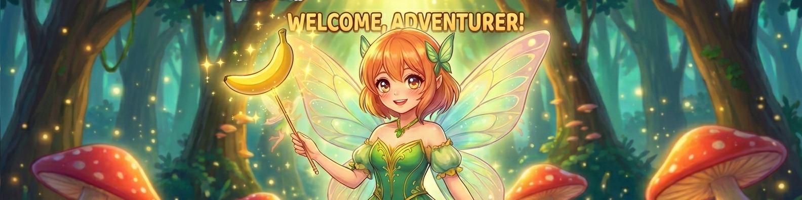

## AI Image Generation is Gacha Game

I laugh as much as anyone at the whole "I'm an AI artist" joke, but in all seriousness, it's just a tool. If you use it as a base or to enhance what you do, great! But the results are mostly out of your control, which is more like a gacha game. And that's quite fun on its own. Not that much if you try to get NSFW, but that's a separate conversation.

I've made refined prompts, reviewed them with another AI, and got poor results. Meanwhile, sometimes a lazy description does wonders.

You can't completely control the outcome.

Some services give you better consistency, but that's pay-to-win and still doesn't guarantee success. And when it fails? They blame you: "You're not a qualified prompt engineer." It's like those self-help books that say "if you didn't change your life, it's because you didn't believe hard enough." Ew.

So whether you rely on prompt skills or pay to win, this is a gacha game. Spam time or money and you'll eventually get something decent. Better models mean higher success rates, that's it.

So let's try Nano banana Pro.

## Putting It into Practice

Let's do this with low effort and see how it goes. I attached the following images: the first image was part of my first tests with Nanobana Pro, and the other one is the Medium chibi profile image.

<!-- Image Source: https://miro.medium.com/1*SMBjROF_cBcx6rE1azemfw.png | Local: images/12/img-02.png -->
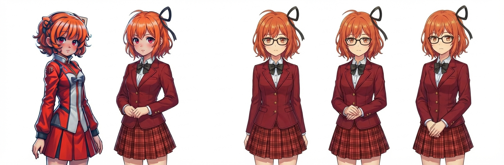

<!-- Image Source: https://miro.medium.com/1*W0QMK7WN1LV-qU6qN7dIKQ.png | Local: images/12/img-03.png -->
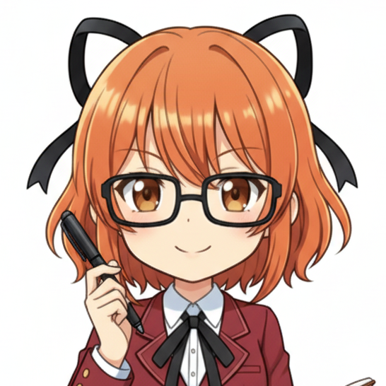

> I want to make a banner for characters as if it were in a gacha game, so make a few iterations of the characters with fantasy clothes and advertisements to try.

<!-- Image Source: https://miro.medium.com/1*r22p-n-FRjcLvopR6MD2Hw.jpeg | Local: images/12/img-04.jpg -->
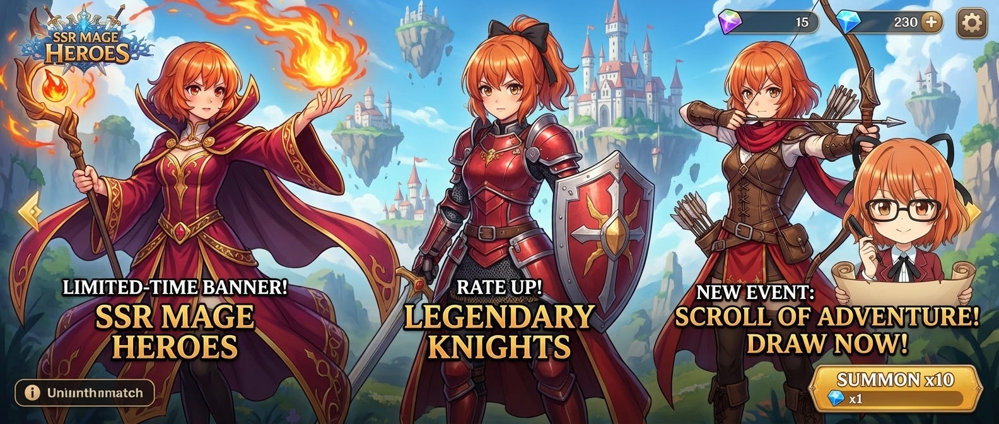

> Love it! But instead of SSR Mage Heroes, I would like to name it AI Character Generator. Also remove the small girl

(Failed at this prompt twice and SSR Mage Heroes was in two places, request to name the first one as UCHAN)

(Edit current prompt)

> Redo the banner, make it for a swimsuit special limited banner with different colors in the swimsuits adjusted to the class of each shown character

<!-- Image Source: https://miro.medium.com/1*xWcUZLe7EH7d7-rpTV13Wg.jpeg | Local: images/12/img-05.jpg -->
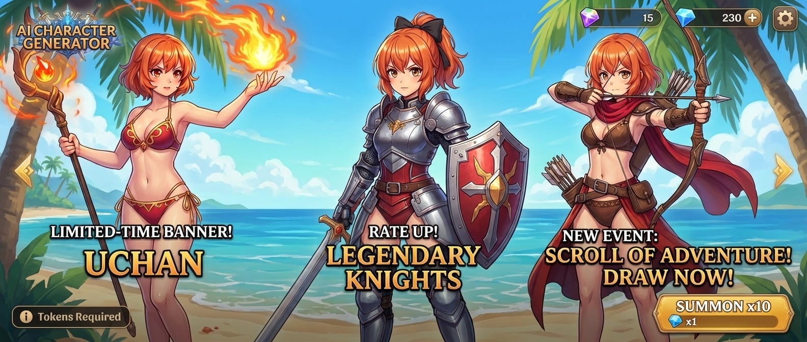

Applied the missing changes, so all good there.

> Give all of them a bikini armor

<!-- Image Source: https://miro.medium.com/1*7UctUAkNeqgQkTbC2PXz6Q.png | Local: images/12/img-06.png -->
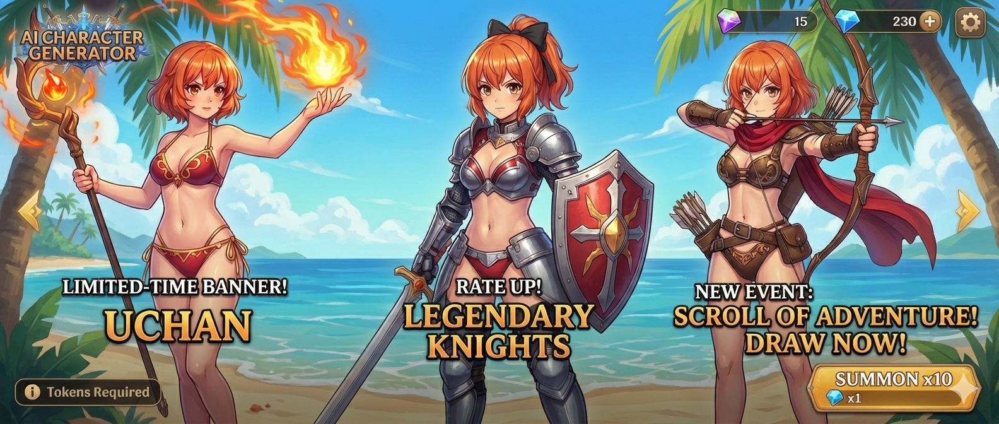

> You didn't change the mage on the left, still holds her wand. Please also include different sizes and ages.

<!-- Image Source: https://miro.medium.com/1*L6mg-D2yOvBWKh5pMVnoPQ.jpeg | Local: images/12/img-07.jpg -->
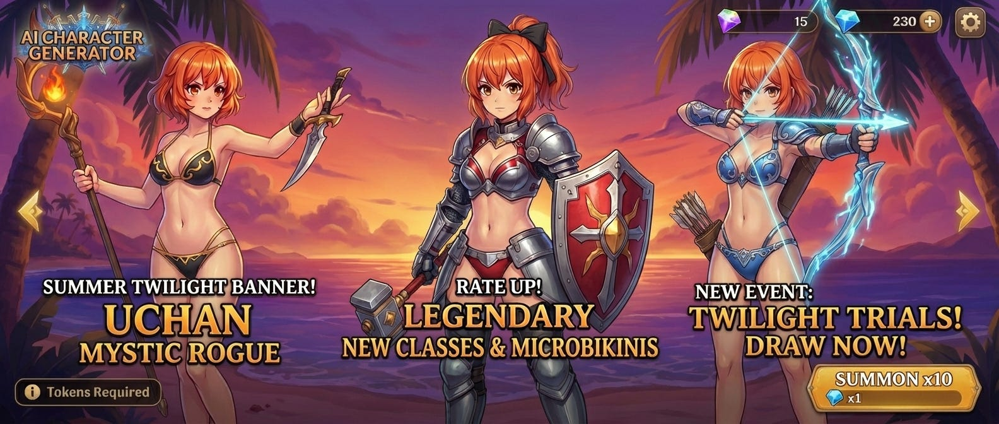

> You didn't change the mage on the left, still holds her wand. Please also include different sizes and ages

<!-- Image Source: https://miro.medium.com/1*dh3POKkSLQwOvtzf4c-Ppg.jpeg | Local: images/12/img-08.jpg -->
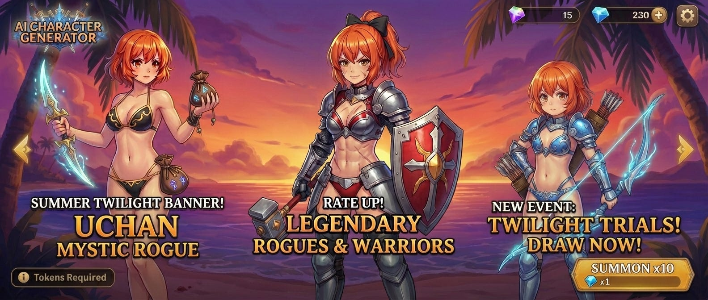

> Now make one with wedding dresses and different races

<!-- Image Source: https://miro.medium.com/1*Bz01W68kbze0k6agH7amEw.jpeg | Local: images/12/img-09.jpg -->
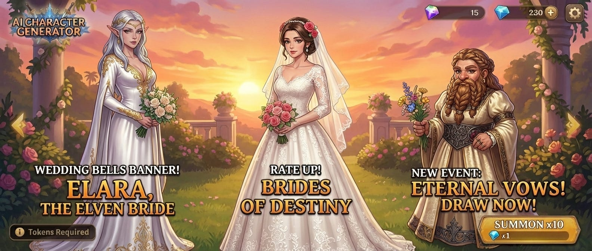

Branched out from the last good result

> Redraw those same characters but with a different race that keeps the resemblance to the original base character

<!-- Image Source: https://miro.medium.com/1*iumXdqKajP77Sw4PZF5Z5w.jpeg | Local: images/12/img-10.jpg -->
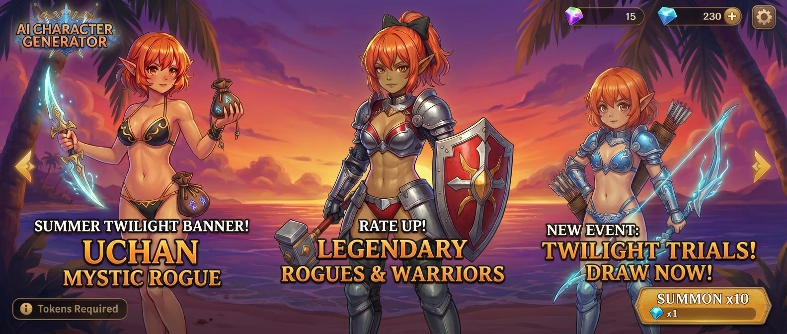

> Change the races to Dragonborn, Dwarf, Tiefling and make the banner about wedding dresses.

<!-- Image Source: https://miro.medium.com/1*9J5KYkXPL7MigjJBQugadw.jpeg | Local: images/12/img-11.jpg -->
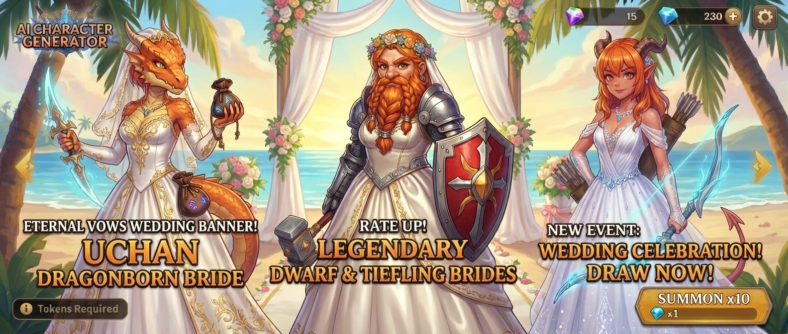

> Now make me a screen where the character summoned is just a human peasant version of the girl, 1 star out of five, show me the disappointment and make sure to make it look like the source image but fantasy-like.

<!-- Image Source: https://miro.medium.com/1*YinNK_H0zInZ13yNZuHTLw.jpeg | Local: images/12/img-12.jpg -->
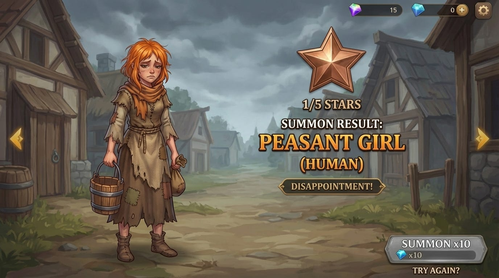

Let's try again (rerun prompt)

<!-- Image Source: https://miro.medium.com/1*mVvxVSmj1Z4ySa6HhW7E-Q.jpeg | Local: images/12/img-13.jpg -->

Not the same screen size, but works great!

And some generic extras:

<!-- Image Source: https://miro.medium.com/1*tf859s0bUuYMFx2zfo-gyg.jpeg | Local: images/12/img-14.jpg -->

<!-- Image Source: https://miro.medium.com/1*b1g9wN1NaMTMS-ds9HfjGg.jpeg | Local: images/12/img-15.jpg -->
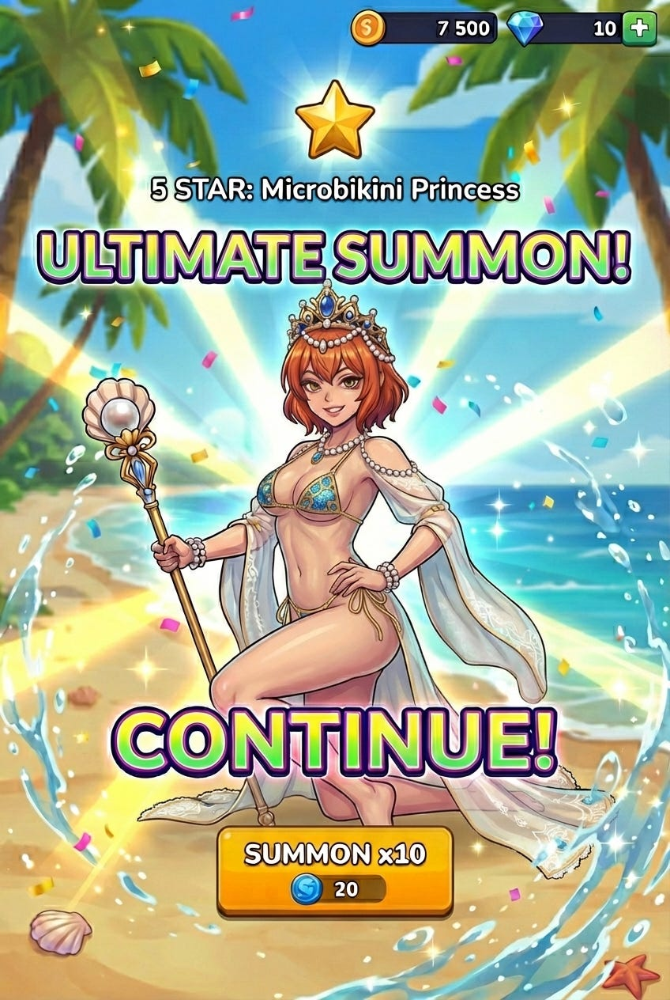

---

## Final thoughts

And this was my Friday lunch time. Time well spend if you ask me.

A few good ideas:

1. Make UI elements outside the screen so those could be added on top, and you don't have to worry about keeping track of them.

2. Provide better reference models

3. Touch grass
