<!-- Source: https://medium.com/@mister.funable/my-favorite-figmas-2025-a4dd70db6be4 -->
<!-- Published: 2025-11-26T22:16:54 -->
# My Favorite Figmas - 2025

With over 160+ Figmas, of course I have some favorites. I meant to do a video about this, but if I don't... at least I have this post!

<!-- Image Source: https://miro.medium.com/1*E5C46nI_jSBJxrIVbjz7jA.png | Local: images/13/img-01.png -->
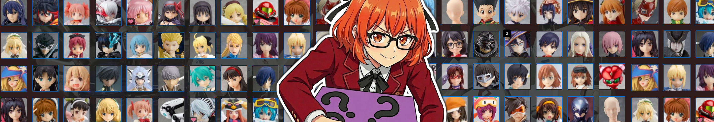

You can tell a lot about me based on my taste in anime/waifus. So beforehand, sorry for oversharing! Let's goooooooo

## Best Waifu Tier

<!-- Image Source: https://miro.medium.com/1*U5rTqeJzlANTtewY-XBhPw.png | Local: images/13/img-02.png -->
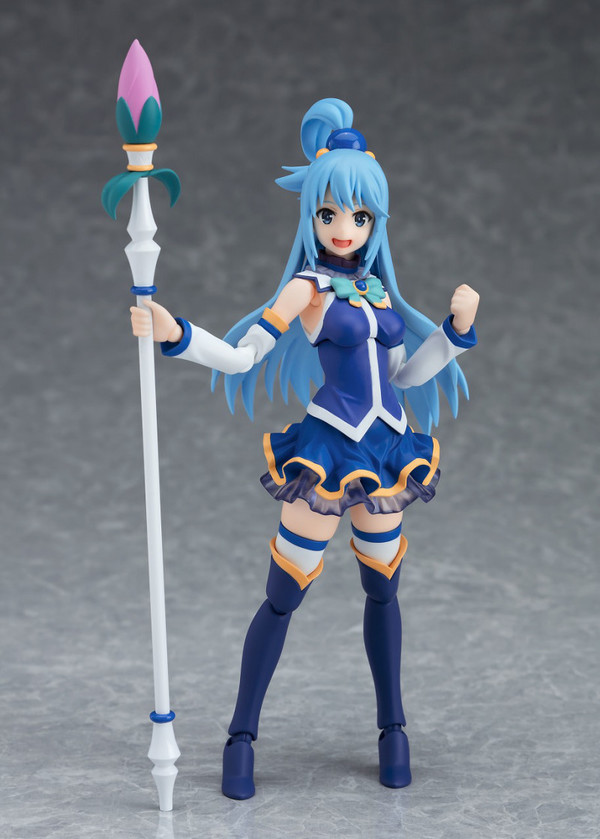

<!-- Image Source: https://miro.medium.com/1*0z1XAny3iM8G-P4_X9N6FQ.png | Local: images/13/img-03.png -->
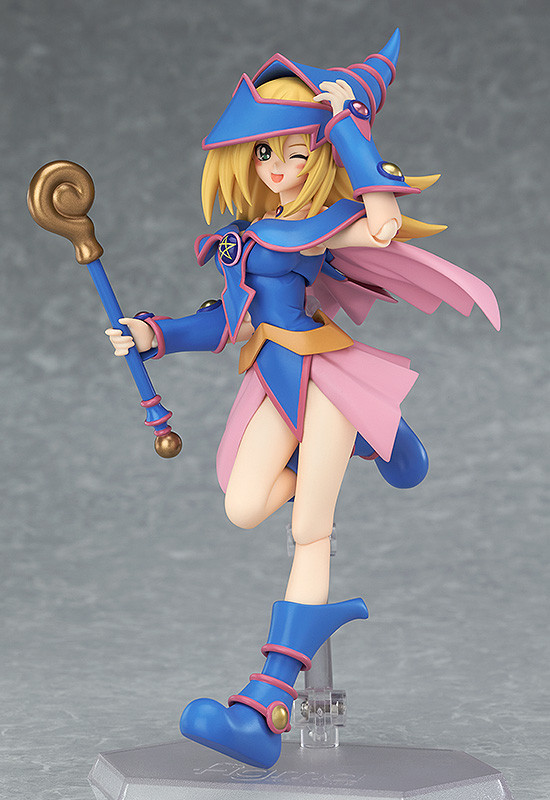

<!-- Image Source: https://miro.medium.com/1*uP3PfhOL8_umVcThbZXrPw.png | Local: images/13/img-04.png -->
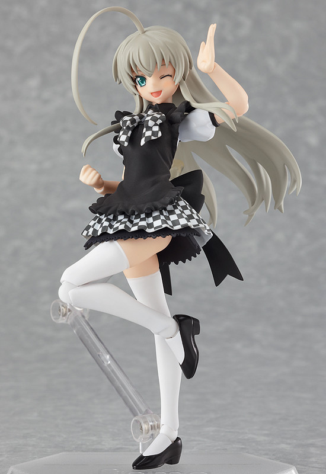

> I would expect a reaction like: "Nyaruko? understandable. Dark Magician? A classic. Aqua??? Why???"

- [Aqua](https://myfigurecollection.net/item/675314): The colors, the character, and the facial expressions!

- [Dark Magician Girl](https://myfigurecollection.net/item/236205): (G)old.

- [Nyaruko](https://myfigurecollection.net/item/106984): I'm kinda into lovecraftian waifus, plus she's a deredere, and those heels? 10/10.

---

## Armor Tier

<!-- Image Source: https://miro.medium.com/1*yUmBkU7eQU7XNsjxfTrFgg.png | Local: images/13/img-05.png -->
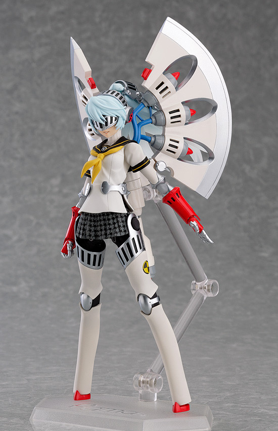

<!-- Image Source: https://miro.medium.com/1*jgfqbtDdOaF7yIZOH_5JtA.png | Local: images/13/img-06.png -->
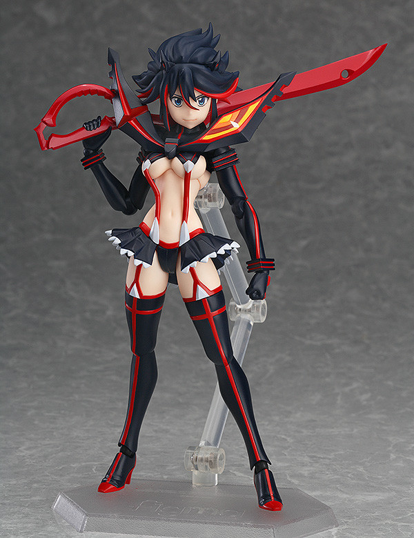

<!-- Image Source: https://miro.medium.com/1*HsG-N-JB4ofNZ-ugbd7yrw.png | Local: images/13/img-07.png -->
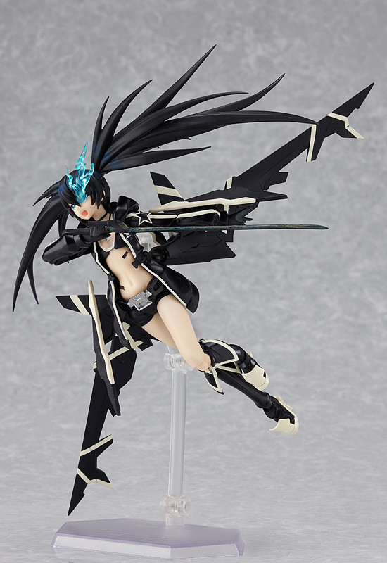

- [Labrys](https://myfigurecollection.net/item/117923): Everyone loves toasters with a detachable axe that looks like butterfly wings. Also armor and rocket punches.

- [Ryuko](https://myfigurecollection.net/item/198008): For the plot/personality of course. Here's the [47 min video](https://youtu.be/IdeJ1FKdiQE?si=uaxN-MM8UOOGh1Wm) explaining that.

- [Black Rock Shooter](https://myfigurecollection.net/item/75621): I've always liked the character design, and the bikini above all else. I don't have more from this franchise (besides White) because it's pretty expensive.

---

## I Can (Not) Explain Tier

<!-- Image Source: https://miro.medium.com/1*NAdWvrJ4-07FNab_FMLzVw.png | Local: images/13/img-08.png -->
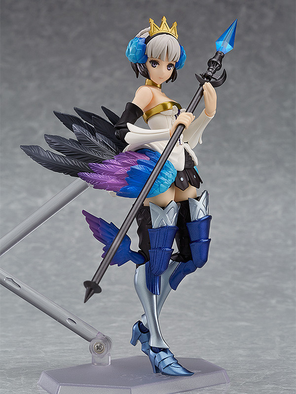

<!-- Image Source: https://miro.medium.com/1*B30dB2UwN4I6P5jSRCAn6w.png | Local: images/13/img-09.png -->
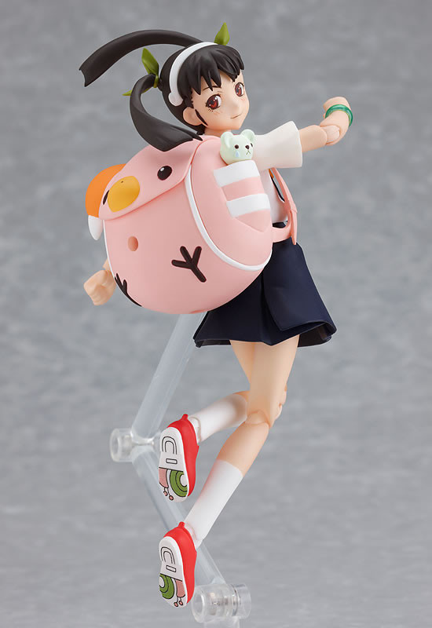

<!-- Image Source: https://miro.medium.com/1*HeHvsm7FR8ZKZSG7fCB4HA.png | Local: images/13/img-10.png -->
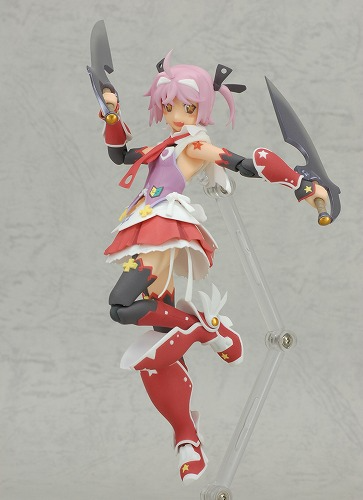

> Cute is justice

- [Gwendolyn](https://myfigurecollection.net/item/553119#): Reminds me of Melia (XC1). I haven't played the game, but bird girl 👏 

- [Hachikuji](https://myfigurecollection.net/item/61332): It's not what it looks like. The design is cute, plus did you see those shoe soles?

- [Cute](https://myfigurecollection.net/item/10216): It's what it looks like... cute design, same character designer as Monogatari and Popotan (if you are that old).

---

## Tied at 10 Position Tier

<!-- Image Source: https://miro.medium.com/1*BrNFPqJY4tnYEJq8wx8PAQ.png | Local: images/13/img-11.png -->
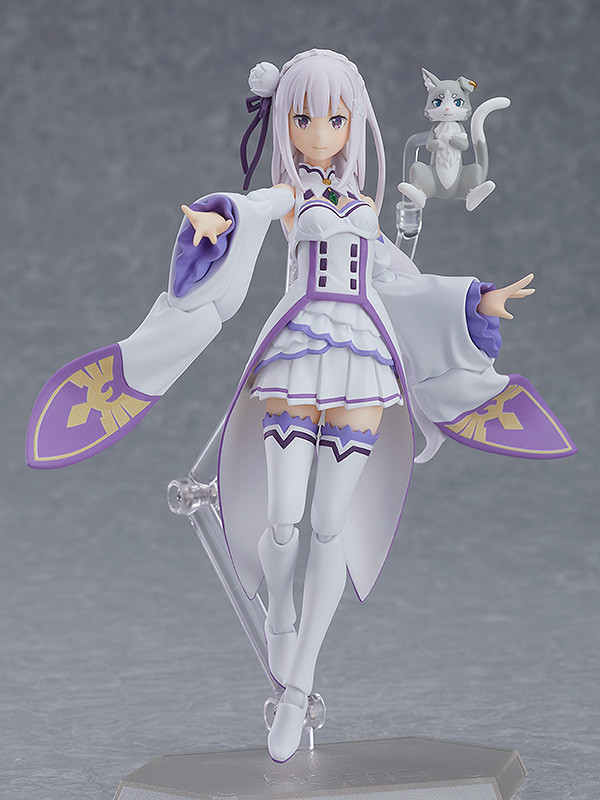

<!-- Image Source: https://miro.medium.com/1*CshBUmsRhGkVNAcwEtMxvg.png | Local: images/13/img-12.png -->
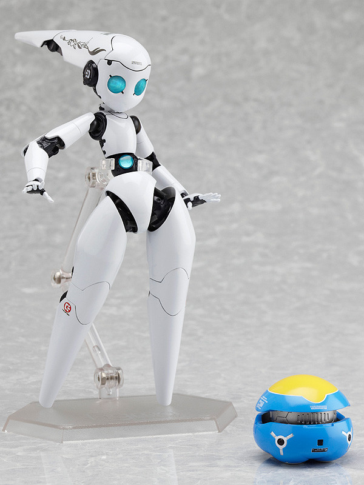

> This could be either place 10 or 1 depending on the mood.

- [Emilia](https://myfigurecollection.net/item/729346): I was here before season 3 defending the greatness of Emilia. Also, my first Figma.

- [Drossel (Charming)](https://myfigurecollection.net/item/61376): amazing figure, one of my favorites if not THE favorite.

---

## Honorable Mentions

<!-- Image Source: https://miro.medium.com/1*txOxEfc6s22z7uMbrmaPAg.png | Local: images/13/img-13.png -->
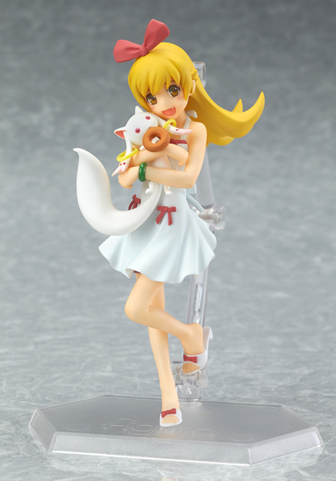

<!-- Image Source: https://miro.medium.com/1*JwWyP0u7nti7RMQE8LgdNA.png | Local: images/13/img-14.png -->
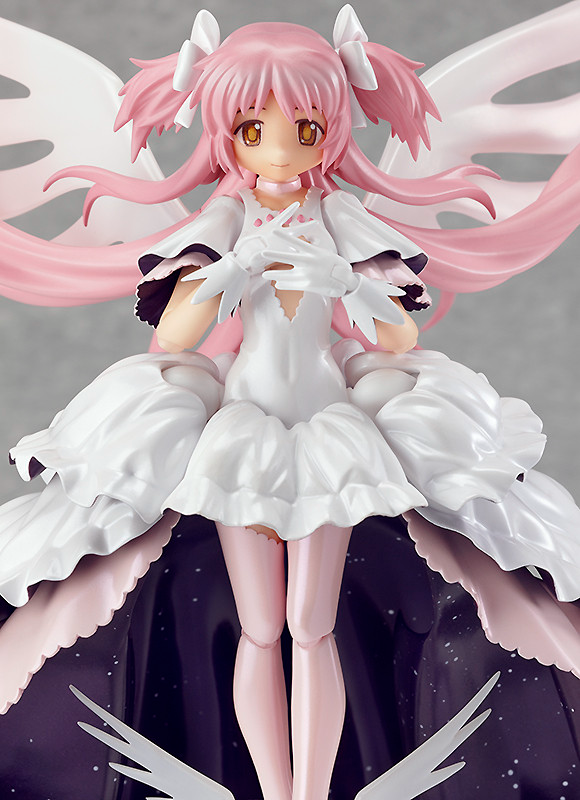

<!-- Image Source: https://miro.medium.com/1*75x6fN6yiSaszUYAsAcfqw.png | Local: images/13/img-15.png -->
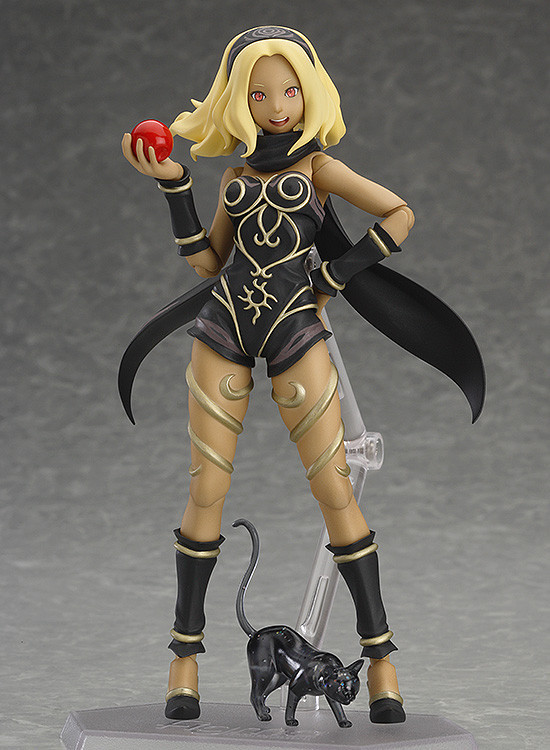

> Do I like Madoka Magica because of the figures or do I like the figures because of Madoka Magica?

- [Shinobu](https://myfigurecollection.net/item/341015) (FigFix): A collab with Madoka Magica. Since it's a FigFix, no articulation visible.

- [Ultimate Madoka](https://myfigurecollection.net/item/117907): Not a spoiler after 10+ years. Wonderful dress, horrible to pose. Overall great. Good moment to mention the [movie parody](https://youtu.be/B5cnT0r3Fa0?si=9u5rsGp74Q8XbuFX&t=850) with enough Star Wars references.

- [Dusty](https://myfigurecollection.net/item/346557): Love the design and the poses you can make with her. I got recently [Coucy](https://myfigurecollection.net/item/462172) and I thought I would like it more, but no.

<!-- Image Source: https://miro.medium.com/1*5O6fW0wfFUOqPvs18Zwtfw.png | Local: images/13/img-16.png -->
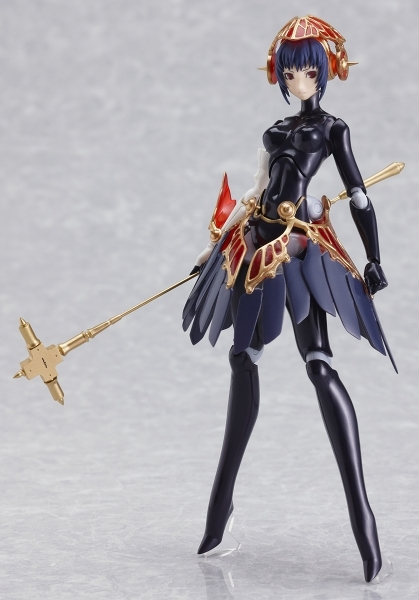

<!-- Image Source: https://miro.medium.com/1*syliJU6AOZs3FBJNxR-6YQ.png | Local: images/13/img-17.png -->
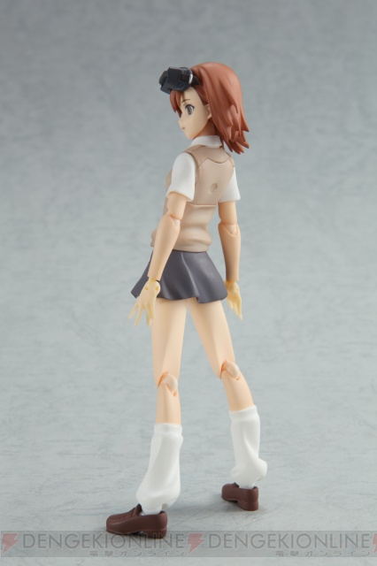

<!-- Image Source: https://miro.medium.com/1*jD92H_ukDm1pAw8X-Lam3g.png | Local: images/13/img-18.png -->
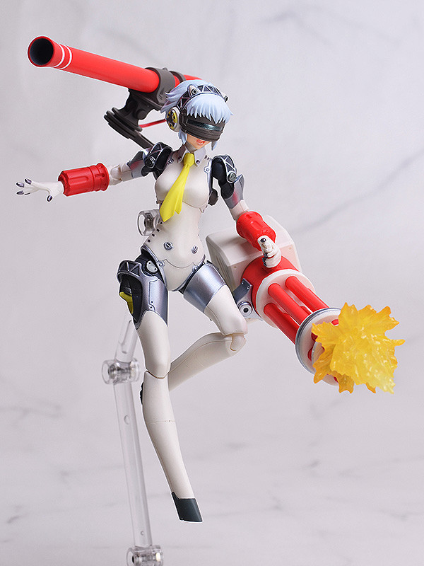

> Soulless machines... at least one of them.

- [Metis](https://myfigurecollection.net/item/42067): It may be a relative simple design, but I love the mask (like the frame on the [FES OP](https://youtu.be/lGjPut-k-7U?si=nAv6uUGaF7JdwOVm&t=42)) and that's enough for me.

- [Misaka Imouto](https://myfigurecollection.net/item/48795): I like [Misaka Mikoto](https://myfigurecollection.net/item/37863) more, but this clone of her comes with a big sniper rifle and machine gun.

- [Aigis](https://myfigurecollection.net/item/122075): KIMI WA NE TOSHIKA NI ANO TOKI (but with [Labrys](https://myfigurecollection.net/item/117923) colors).

---

And that's it! I will probably make one for B-Style but until then,

Peace!
