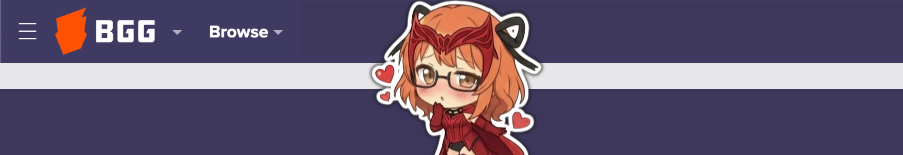
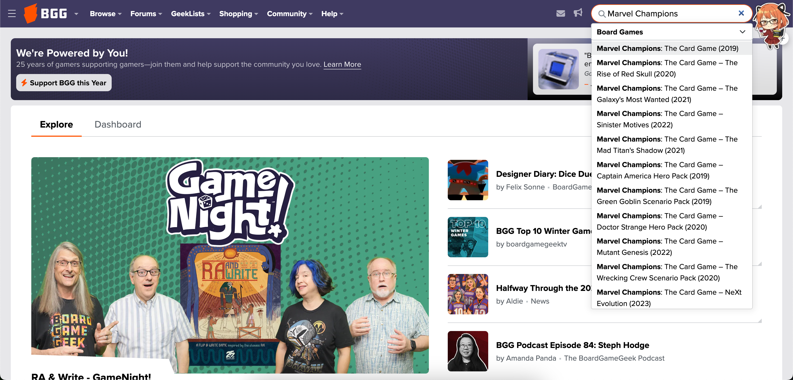
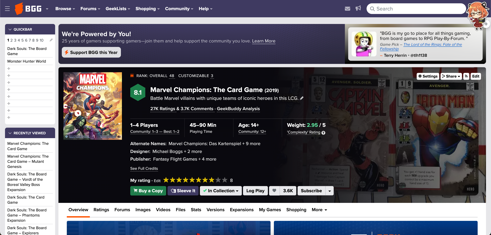
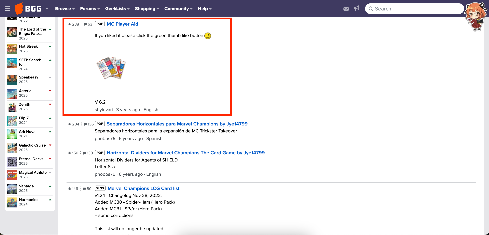
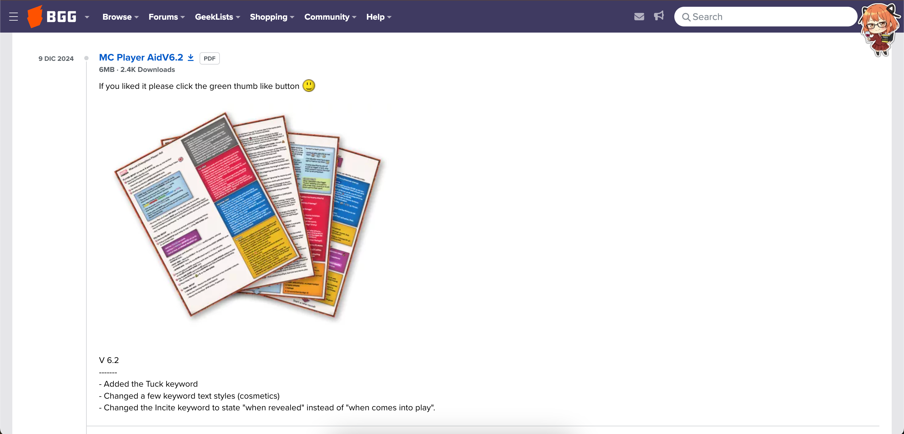
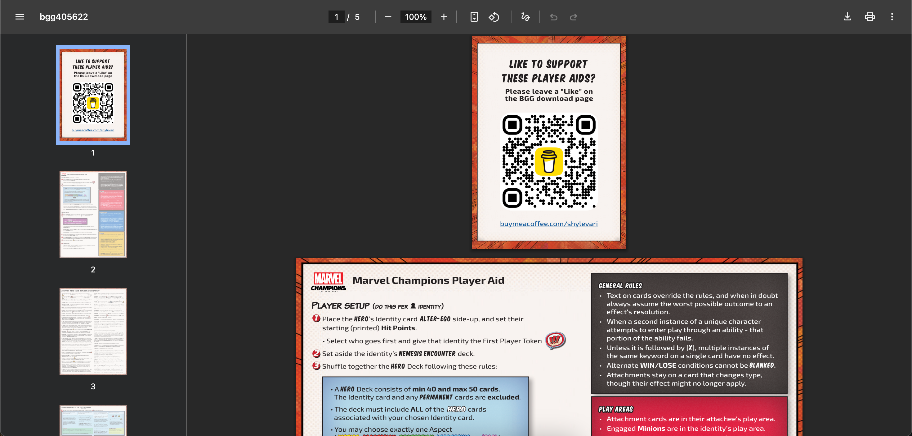

<!-- Source: https://funable.medium.com/boardgamegeek-player-resources-aids-b0a37d238455 -->
<!-- Published: 2025-12-21T18:43:52 -->
# BoardGameGeek Player Resources / Aids

I used to think [BoardGameGeek (BGG)](https://boardgamegeek.com/) was basically: forums, deals, and a place to track your collection. Which is true. But it's also a big vault of community-made stuff: quick-reference sheets, custom rules, campaign trackers, print-and-play extras, and "this fixes the game" variants.

<!-- Image Source: https://miro.medium.com/1*zqhI3VNf2XgISTIY-43MYg.png | Local: images/15/img-01.png -->

And I only noticed because I started hitting the classic problem: I _know_ we played this last month, but do I remember the rules correctly... or am I confidently making things up because it's 1 AM and someone just said "trust me"? In my case, I started struggling with some stuff in _Horizon Zero Dawn_ from Steamforged Games (SFG), went digging, and realized BGG had way more practical help than I expected.

Also, my group swaps games a lot depending on the general consensus (or the sober level), so recalling rules quickly is genuinely helpful.

---

## Finding resources

<!-- Image Source: https://miro.medium.com/1*j59qTRrRhQBjA3ET6OVhag.png | Local: images/15/img-02.png -->

Go to [BoardGameGeek](https://boardgamegeek.com/) and use the **search bar**. Type the game name (ex: "Marvel Champions"), then open the game's main page.

---

<!-- Image Source: https://miro.medium.com/1*VTo9DMpdfTw2o9Mb2E24aA.png | Local: images/15/img-03.png -->

Once you're on the game page, you'll see a bunch of tabs/sections and a bunch of numbers (rating, complexity/weight, rank, etc.).

I used to ignore those metrics, but they're useful context. Also, seeing my own rating staring back at me is a nice reminder that I'm not unbiased. (My current Marvel Champions score is basically "9/10 with expansions," so yeah... I'm a little biased.)

### Quick map of the tabs (what each one is for)

Here's the "what do I click?" map, in normal people terms:

- **Overview**: the game's main info, credits, awards, and general details.

- **Ratings**: user ratings and written reviews.

- **Forums**: where you go when you think you found a rules issue, and discover it's been discussed for 7 years.

- **Images**: community-uploaded images (components, fan content, inserts, etc.).

- **Videos**: community video links (yes, you can link YouTube).

- **Files**: **the good stuff**. Player aids, reference sheets, print-and-play extras, trackers, variants, and more.

- **Stats**: rankings, charts, and other number-heavy things.

- **Versions**: different editions/printings/languages.

- **Expansions**: related content tied to that game.

- **My Games**: your personal logs (ownership, plays, etc.) if you track that on BGG.

- **Shopping**: listings from users/stores.

- **More**: extra options. I only recently noticed there's often a **wiki/community content** option in here too. (Yes, I found this late. Yes, I felt dumb.)

---

## The actual goal: downloading a Player Aid from "Files"

<!-- Image Source: https://miro.medium.com/1*u2Pd0nwQfcyD1z44sJ71tg.png | Local: images/15/img-04.png -->

Click **Files**.

From here, you'll usually see categories and a list of uploads. If you're looking for a **Player Aid**, scroll and look for titles like "Player Aid," "Quick Reference," "Reference Sheet," "Setup," etc.

In my case, for the version I wanted, I scrolled down and...

<!-- Image Source: https://miro.medium.com/1*TPD7GLVFLrJmPaASlOtmmA.png | Local: images/15/img-05.png -->

Yup. That's the one. [Click it](https://boardgamegeek.com/filepage/253921/mc-player-aid)!

---

<!-- Image Source: https://miro.medium.com/1*97o1tp7R68U1klQPU7M1Jg.png | Local: images/15/img-06.png -->

**Small requirement:** you need to be **logged in** to download files.

Click the hyperlink text and you will get the resource!

<!-- Image Source: https://miro.medium.com/1*MJLeICxTNYDiojWb9PLdVw.png | Local: images/15/img-07.png -->

And please do the polite internet thing:

- **Like / thank the creator** (it costs you nothing).

- **Donate if you can**, especially if you're actually using the file a lot. These aids save real table time.

---

> _**TL;DR:** BGG isn't just forums and collection tracking. The **Files** section is a cheat code for player aids and community fixes._

It might seem overkill to write a post like this, but it's easy to miss what's right in front of you when you're deep in Reddit threads or doing the classic "google the same question five different ways." Sometimes the answer is just... already there.

Don't forget to like the creator and if you can donate!
