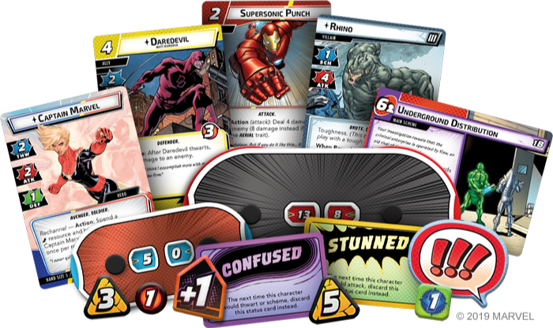
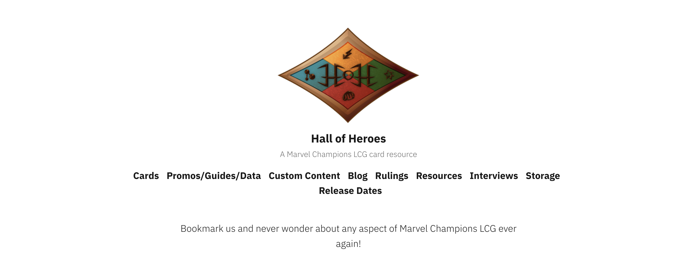
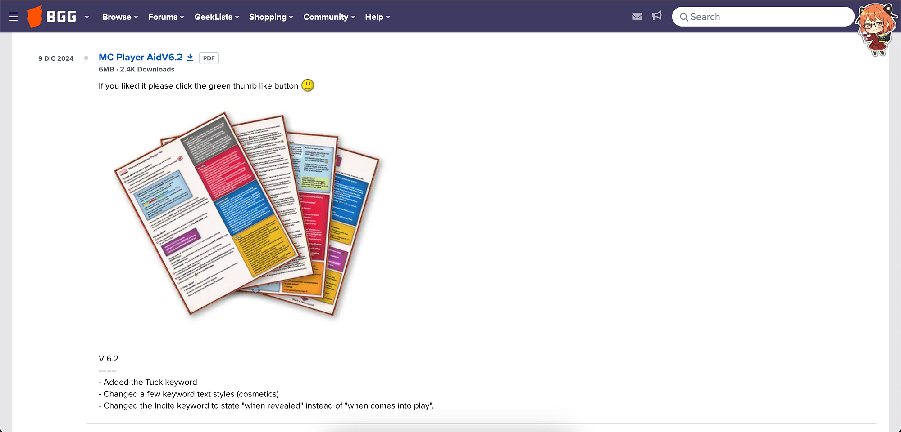
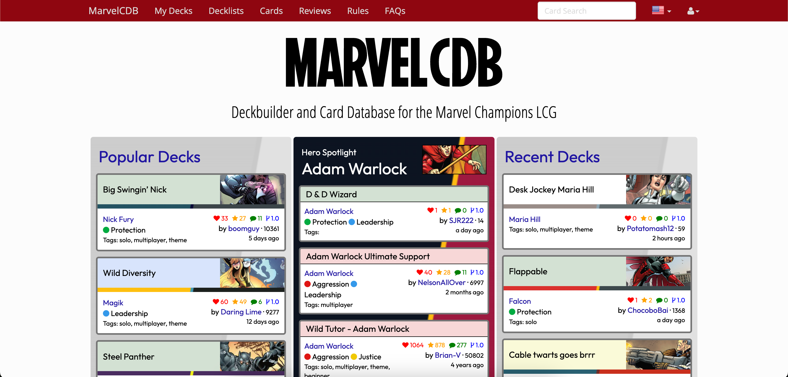

<!-- Source: https://funable.medium.com/marvel-champions-resources-7f6cef0bffe7 -->
<!-- Published: 2025-12-21T18:57:54 -->
# Marvel Champions Resources

I already have my own page where I dump links and notes, but I wanted something simpler I can share with friends who are just getting into the game. So here you go.

<!-- Image Source: https://miro.medium.com/1*zkgfdm3t1bqVfSwf1W35kw.png | Local: images/16/img-01.png -->

At first, I didn't have much hope for _**Marvel Champions**_. I thought it was going to be another "same rules, different hero skin" situation.

But after playing it... yeah, I was wrong. The game is really good at adapting different heroes under the same rules while still making each one feel like their own thing. Same core structure, totally different vibe depending on who you're playing. That "individual approach" is what made it click for me, and it's also why I ended up going down the resources rabbit hole.

Overview (what these links help with):

- **News / Guides**

- **Summary / Quick Reference**

- **Deck builder and Database**

- **Clarifications / FAQ**

---

## Marvel Champions Resources (Links for the Uninitiated)

<!-- Image Source: https://miro.medium.com/0*k-TwPZUXPEKKadsp | Local: images/16/img-02.png -->

### Hall of Heroes

<!-- Image Source: https://miro.medium.com/1*nH03HwDxvigyVo08aZ4JUg.png | Local: images/16/img-03.png -->

Most of what you'll be looking for can be found on **[Hall of Heroes](https://hallofheroeslcg.com/).** Things like news, releases, card info, and a bunch of community-friendly resources.

Two sections I suggest:

- **[Getting Started](https://hallofheroeslcg.com/2020/04/27/welcome-to-marvel-champions-lcg-whats-next/)**: great for onboarding someone without info-dumping the entire Rules Reference at them.

- **[Alternative art / hero cards](https://hallofheroeslcg.com/extrasandpromosandcustomcontent/#2020playshare)**: if you're okay with proxies, this is super fun. Great for printing nicer-looking hero cards or just customizing your stuff.

You can go from there and find more, like Discords and Subreddits.

---

### Player Resources / Aid (Quick Reference)

<!-- Image Source: https://miro.medium.com/0*XLHJvahdoLmKVwtv.png | Local: images/16/img-04.png -->

So this section became a dedicated post ([BoardGameGeek Player Resources / Aids](https://medium.com/@mister.funable/boardgamegeek-player-resources-aids-b0a37d238455?postPublishedType=initial)). You can download it from [here](https://boardgamegeek.com/filepage/253921/mc-player-aid).

It's a little old, but it has a summary of rules and effects. Super useful when you don't want to re-read the whole rulebook, plus the special rules and game mechanics manuals.

As an extra, here is the link to the [BGG Community Wiki](https://boardgamegeek.com/boardgame/285774/marvel-champions-the-card-game/wiki).

---

### Cards and Decks

<!-- Image Source: https://miro.medium.com/1*F7FUc2vjoljIPCP3m7QRjg.png | Local: images/16/img-05.png -->

- **[MarvelCDB (Deck Builder + Deck Lists)](https://marvelcdb.com/)**: build decks, find prebuilt community decks, and check notes/clarifications people add for specific cards.

---

### Extra Things

- **[Marvel Champions Unofficial FAQ](https://docs.google.com/document/d/1LoxeYzEQ0HIkf3_aSi1qOTWbBdZ6_j1_3zkJBNm0EcY/edit?pli=1&tab=t.0#heading=h.sksnqj5ctvym)**: when you need "okay, but how do people actually play this card interaction?" explanations.
If you can't find it immediately, I usually just search for "Unofficial FAQ"

- **[Sleeve Your Games](https://www.sleeveyourgames.com/sleeves/search?query=marvel%20champions)**: if you want an estimate of how much it'll cost to sleeve everything (core + expansions + the ever-growing pile of cards).

---

That's all!
