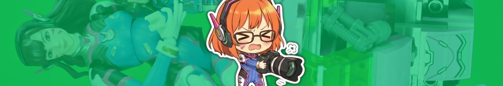
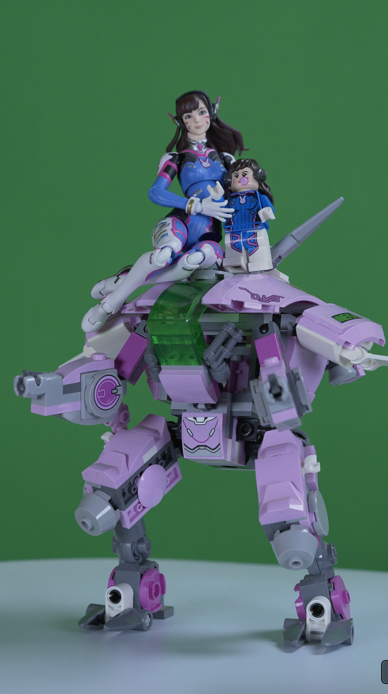
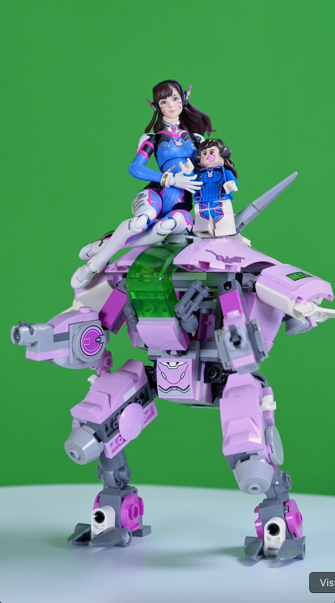
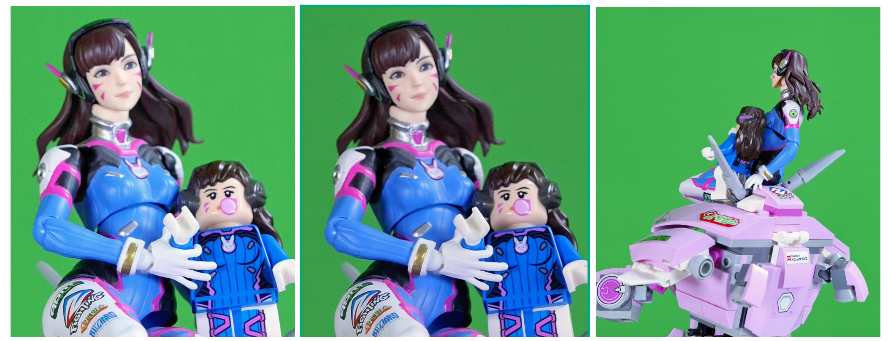

<!-- Source: https://funable.medium.com/sony-a6700-updated-settings-for-turntables-with-a-green-background-657dcd66d160 -->
<!-- Published: 2025-12-27T17:46:35 -->
# Sony A6700 Updated Settings for Turntables with a Green Background

A friend told me my footage looked green. And I was like: "No way, it's pale. It's fine." Then I touched the Tint slider _just to test_... and ho boy. It was green. Now I can't unsee it.

<!-- Image Source: https://miro.medium.com/1*HPN0Ta20bqB_LMf_XCRbIQ.png | Local: images/17/img-01.png -->


I already covered my general setup, lenses, and workflow in [Sony A6700 Settings for Unboxing and Figure Videos](https://medium.com/@mister.funable/sony-a6700-settings-for-unboxing-and-figure-videos-4ca3ddd4ecac).

This post is the update for my **turntable videos with a green background**, and what I changed to reduce the "fix it in post" tax. Mainly focused for the lens Zeiss T* FE 55mm f/1.8 but should work relative well with others.

> _**TL;DR:** I'm trying to get closer to showing "how I see things." The green background is not negotiable. Also, yes, I'm making my life harder on purpose._

---

## The "tint fix" that exposed the problem

<!-- Image Source: https://miro.medium.com/1*d81ayCFBvElH5-jRmPuWrg.png | Local: images/17/img-02.png -->


When I pushed Tint from 0 to +25, it looked way more natural.

- **From default to Tint +25**: _(add screenshot here)_

- **From "normal settings" to Tint +25**: _(add screenshot here)_

But fixing it in post is basically admitting defeat.

So the goal became: **reduce the green cast in-camera** so I'm not constantly compensating in CapCut.

<!-- Image Source: https://miro.medium.com/1*WpWud0QakZTkTq_8F4koRw.png | Local: images/17/img-03.png -->


Looks way better and more natural. So let's talk about the camera settings to reduce the compensation.

---

## Updated Settings

Quick notes before the wall of bullets:

- **Log Shooting**: off. I'm using a **Picture Profile** (PP6 / Cine4), so Log needs to be disabled.

- **Shutter speed**: for 60p, I stick to **1/120** (or **1/125** if you're fighting flicker in some rooms).

- **White balance tint**: this is the big one. If your background (or lights) are pushing green, you'll probably need to nudge WB towards magenta.

The rest of settings look like this:

```yaml
Shooting:
 - [1] Image Quality Rec
  - File Format: XAVC HS 4K
  - Movie Settings:
   - Rec Frame Rate: 60p
   - Record Setting: 100M 4:2:2 10bit
  - Log Shooting Setting: ⚠️ Disable this to use Picture Profiles
   - Log Shooting: Off
 - [5] Shutter/Silent:
  - Anti-flicker Set:
   - Var. Shutter: Off
   - Release w/o Lens: Enable. ⚠️ From the camera menu set it to 1/120 or 1/125
 - [8] Image Stabiliaztion:
  - SteadyShot: Off ⚠️ Tripod
 - [10] Shooting Display: 
  - Grid Line Display: On
  - Grid Line Type: Rule of 3rds Grid


Exposure/Color:
 - [1] Exposure:
  - Auto Slow Shutter: Off
  - ISO: Auto 
  - IO Range Limit: Min 250 → Max 800 ⚠️ For Cine4: Start at ISO 250–400 (base)
 - [2] Exposure Comp:
  - Exposure Comp: +0.0
  - Exposure step: 0.3EV 
 - [4] White Balance:
  - White Balance: 
   - Custom 4700–4900K (Manual)
    - White Balance Adjustment: ⚠️ If you use a green background
     - G-M: M +4 (Press down 4 times)
  - Priority Set in AWB: White
 - [5] Color/Tone:
  - Creative Look: Off
  - Picture Profile: PP6
   - PP6:
    - Black Level: +2
    - Gamma: Cine4
    - Black Gamma:
     - Wide
     - +3
    - Knee:
     - Mode: Auto
    - Color Mode: Pro
    - Saturation: +4
    - Color Phase +1
    - Color Depth:
     - R: +3
     - G: 0
     - B: 0
     - C: 0
     - M: +1
     - Y: +1
    - Detail:
     - Level -1
     - Adjust: ⚠️ Defaults but added here for reference
      - Mode: Auto
      - V/H Balance: Auto
      - B/W Balance: Type 3
      - Limit: 7
      - Crispening: 3 
      Hi-Light Detail 0
  Select LUT: (not used in Cine4)
 - [6] Zebra Display:
  - Zebra Display: On
  - Zebra Level: 75

Focus:
 - [1] AF/MF:
  - Focus Mode: Continuous AF
  - AF Transition Speed: 2
  - AF Subj. Shift Sensivity: 2
  - AF Assist: Off
 - [2] Focus Area:
  - Focus Area: Zone 
  - Focus Area Color White
  - AF Frame Move Amt: Standard
 - [3] Subject Recognition:
  - Subject Recognition: OFF
  - Recognition Target: Human
  - Face/Eye AF: OFF
 - [5] Peaking Display: Off


```

---

## RAW vs Current Footage

<!-- Image Source: https://miro.medium.com/1*RE1-WjTzWYYDW3rTMEPLjw.png | Local: images/17/img-04.png -->


<!-- Image Source: https://miro.medium.com/1*yqA9yWoEvJ-5CvC0OPttxw.png | Local: images/17/img-05.png -->


<!-- Image Source: https://miro.medium.com/1*zJ6e8Ypax-U3vw81dc1kkg.png | Local: images/17/img-06.png -->


---

## CapCut Settings

<!-- Image Source: https://miro.medium.com/1*AsHgRJDXyUo4VTjBqcC5JA.png | Local: images/17/img-07.png -->


This is what I'm using right now in CapCut as my "default-ish" adjustments. It's not magic. It's just consistent enough that I stop fighting my own footage.

```markdown
Adjusts
 - Basic
  - Color
   - Temp: 10
   - Tint: 5
   - Saturation: 15
   - Exposition: 20
   - Contrast: 5
   - Light: -8
   - Shadow: 0
   - White: 0
   - Brightness: 5
  - Effects
   - Sharpen: 15
   - Clarity: 15
```

Before, I used to mess with **HSL → Green** to make the lack of standardization less obvious. With this camera setup, it's not as necessary anymore.

---

And that's it for now!
