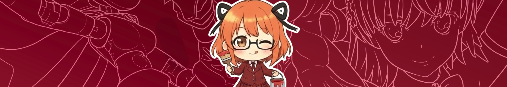
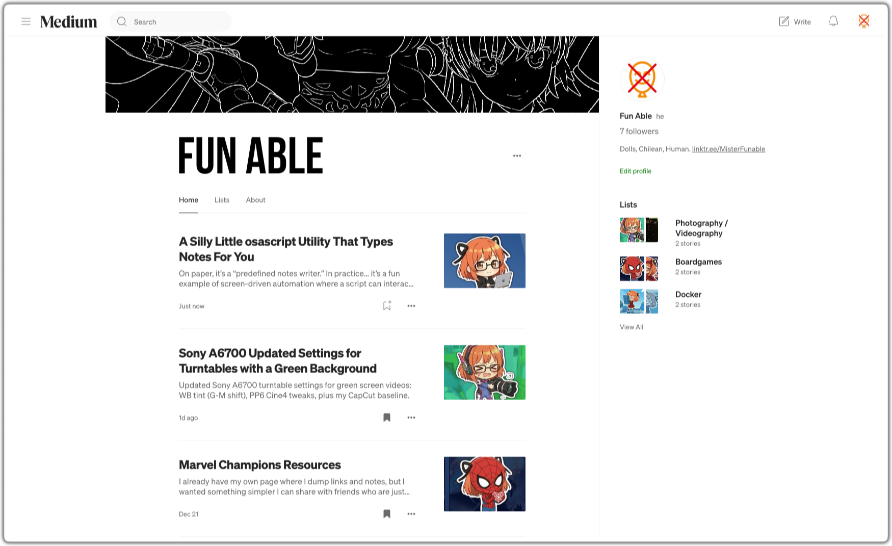
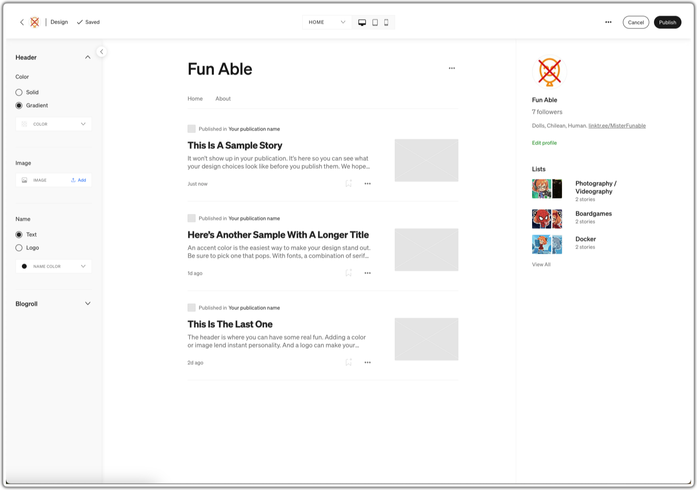
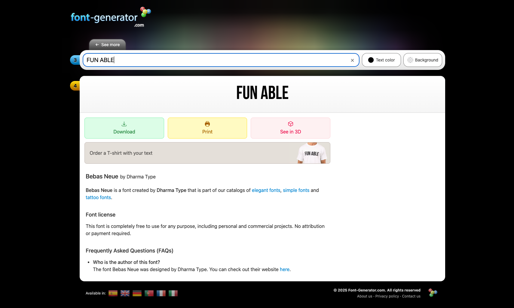
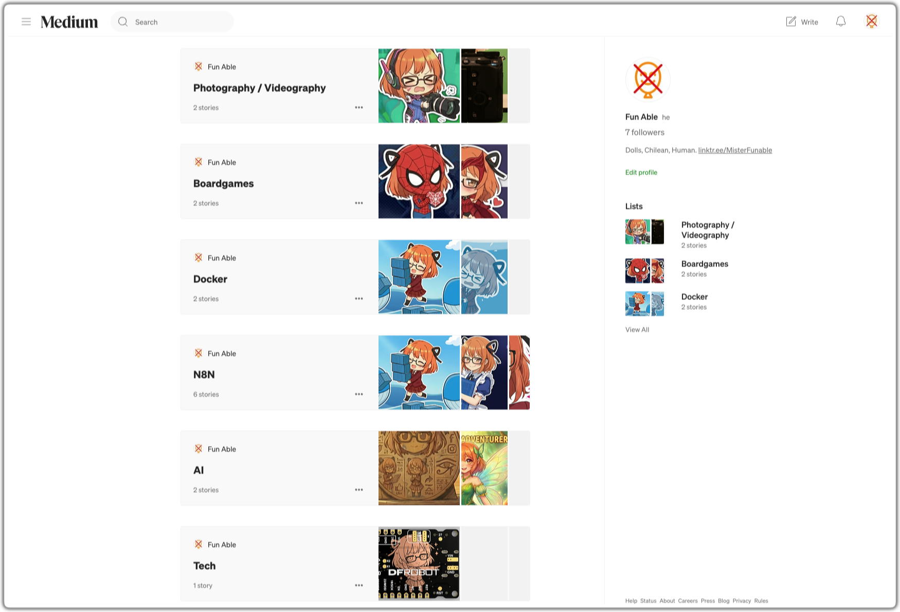
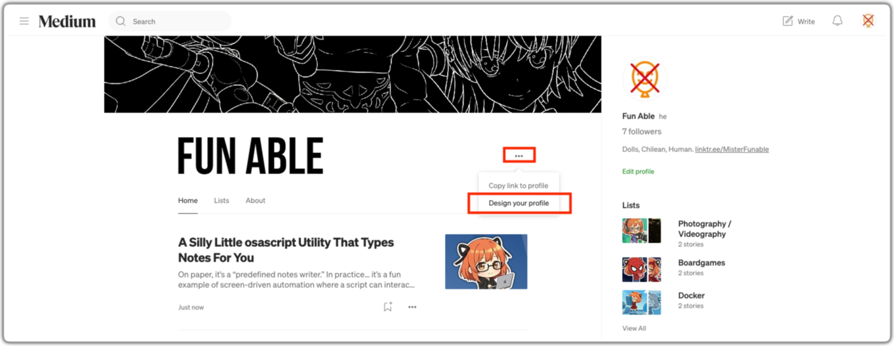
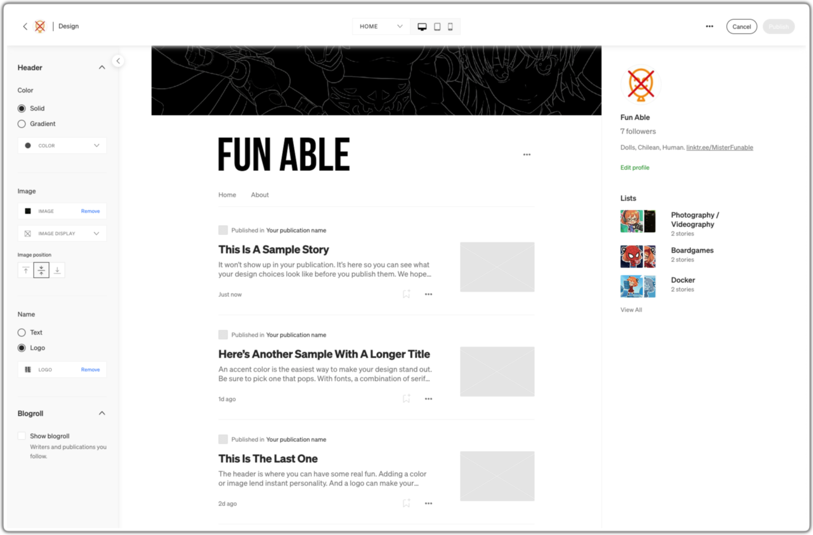

<!-- Source: https://funable.medium.com/how-to-design-your-medium-profile-47d93edd7e9d -->
<!-- Published: 2025-12-29T22:36:42 -->
# How to Customize Your Medium Profile

Back when I made my main account, Medium profiles were pretty barebones, so I never bothered customizing it.

<!-- Image Source: https://miro.medium.com/1*5tah9gQAZjJ7jC4Y9jDnKg.png | Local: images/19/img-01.png -->


But with this one (where I can write more freely), I decided to do a similar personalization/customization so it matches my YouTube and other social media.

To make it look more like this:

<!-- Image Source: https://miro.medium.com/1*R6L3EvwfG-9Vhy-JZyTioA.png | Local: images/19/img-02.png -->


And less like that:

<!-- Image Source: https://miro.medium.com/1*9u8nYFG0hCs59268nCxhKg.png | Local: images/19/img-03.png -->


---

## Available Options

There isn't much to do, but you have a few things to decorate your profile:

- Background + Color & Gradient

- Logo + Color & Gradient

- Blogroll

- Lists

---

## Background

I already made one for YouTube, but if you don't have one, maybe a Subreddit like [r/Wallpapers](https://www.reddit.com/r/wallpapers/) could help or just Google it.

<!-- Image Source: https://miro.medium.com/1*usvipCt0Opzx1-rI8FAdZw.jpeg | Local: images/19/img-04.jpg -->


It was painful generating an art line like that... I'd love to write a post about it, but until I heal from that experience, I won't.

---

## Logo

This was more interesting, since Medium supports having a custom image there.

For a quick "good enough" logo, pick a nice font and download it. I used a [font-generator](https://www.font-generator.com/fonts/BebasNeue/) with Bebas Neue. I don't need to be any fancier than that and probably you too.

If you have to, then insert the "Try Free Canvas and make your own" advice.

<!-- Image Source: https://miro.medium.com/1*3g339LB4wMMvL2qGUmGvgA.png | Local: images/19/img-05.png -->


Download it.

---

## Lists

<!-- Image Source: https://miro.medium.com/1*7JB5ZDG2-xDY91Hykr605A.png | Local: images/19/img-06.png -->


If you don't have any, that's fine. But it's a great (and honestly the only) way to organize stories. Maybe things that you like or would like to quote/reference later could be there publicly.

Plus, lists show up in the menu, so people can click around and don't have to go through the abrupt topic changes you see on my content.

---

## Editing the Design

From your profile, click the three dots, then Design your profile.

<!-- Image Source: https://miro.medium.com/1*aT8OQ2fsEaV8f642W9ywBA.png | Local: images/19/img-07.png -->


The edit menu will look like this:

<!-- Image Source: https://miro.medium.com/1*9u8nYFG0hCs59268nCxhKg.png | Local: images/19/img-03.png -->


I already hid the Blogroll. I personally don't see value in it. It's useful to suggest people to follow, but not for retention. I may be wrong though.

After you submited the already collected assets, it should look like this:

<!-- Image Source: https://miro.medium.com/1*ZhTIdGLkO044y-O0QUwMRA.png | Local: images/19/img-08.png -->


I ended up adjusting the gradient to make the lines pop. Still not convinced, but good enough for now.

<!-- Image Source: https://miro.medium.com/1*R6L3EvwfG-9Vhy-JZyTioA.png | Local: images/19/img-02.png -->


---

## One Last Thing: The Bio

I'm not super fond of bios, but I replaced the "Dolls, Chilean, Human" one with something that better explains what I write about:

```
Chilean human writing about tech, collectibles, and side projects.
Sharing what I build and explore in my free time.

linktr.ee/MisterFunable
```

And with that, my profile is good enough for me... for now.
