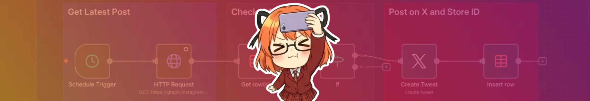
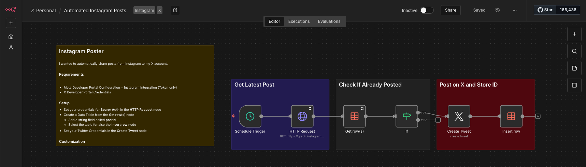

<!-- Source: https://funable.medium.com/getting-instagram-posts-with-n8n-the-simple-way-part-2-the-final-part-fdad1e999d74 -->
<!-- Published: 2025-12-31T12:43:34 -->
# Getting Instagram Posts with N8N (The Simple Way Part 2: The Final Part)

And finally... this is the post where we actually get to Twitter (X).

<!-- Image Source: https://miro.medium.com/1*mCqWqsEUW-vmmfIzluTEMQ.png | Local: images/20/img-01.png -->

The workflow runs on a schedule, checks the Instagram API for your latest post, validates against an n8n Data Table so it doesn't repost, and if it's new, it posts to X and stores the IDs.

Simple. Boring. Reliable. The holy trinity.

If you missed Part 1 (the "how do I even get the Instagram data?" one), it's here: [Getting Instagram Posts with N8N (The Simple Way Part 1)](https://medium.com/@mister.funable/getting-instagram-posts-with-n8n-the-simple-way-part-1-c66cb5217054).

---

## What You Need

- N8N running (local or cloud). Checkout the [Running N8N Locally with Ngrok](https://medium.com/@mister.funable/running-n8n-locally-with-ngrok-734af69e1530).

- A working Instagram token (from Part 1)

- An X Developer account + API credentials that can **post tweets**

- An n8n **Data Table** (to remember what you already posted)

---

## The Code

If you read the [How to Publish Your n8n Template](https://medium.com/@mister.funable/how-to-publish-your-n8n-template-375832d8efd7), you'll remember my favorite coping mechanism:

> _The worst they can say is no._

Well... they said no.

Too simple. Which is fair. So I'm just putting it in a repo where I track my workflows + my little tweaks. There should be a better way to keep track of those things like with Terraform or something. I'll eventually look into it.

I'll link it [here](https://github.com/MisterFunable/[n8n-templates](https://github.com/MisterFunable/n8n-templates)) once it's public (it's called n8n-templates because I'm a good at naming things).

---

## Workflow Overview

This is the file that you [need](https://github.com/MisterFunable/n8n-templates/blob/main/Instagram%20to%20X/template.json) to paste on a new (ideally empty) workflow.

<!-- Image Source: https://miro.medium.com/1*5MHZjLUMEWw7jN1wEIe6Bg.png | Local: images/20/img-02.png -->

This is the entire logic:

1. **Schedule Trigger** (runs every X minutes/hours)

2. **HTTP Request** → get latest IG post (`limit=1`)

3. **Data Table: Get row(s)** → "did we already post this IG media id?"

4. **IF** → if not found, continue. If found, stop.

5. **X: Create Tweet**

6. **Data Table: Insert row** → store the IG media id + tweet id

---

## Setup Steps

- Set your credentials for Bearer Auth in the HTTP Request node.

- Create and associate a Data Table in the Get row(s) node. Select the same table for the Insert row node.

- Set your X Credentials in the Create Tweet node.

- Spam your content.

---

## What's Next

My YouTube channel got removed with no explanation, so that's that. Story for another day.

But it did push me to separate content more cleanly, starting with dedicated IG accounts. That's probably the next post.

And that's it.
