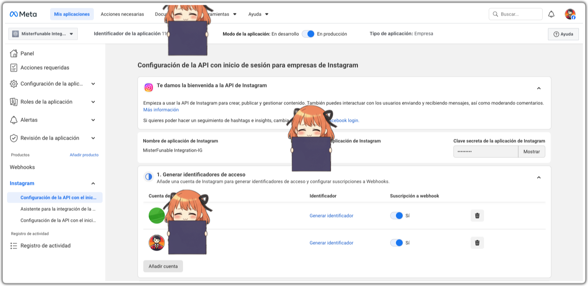
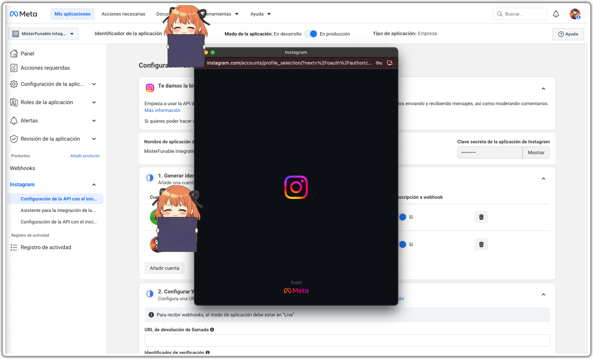
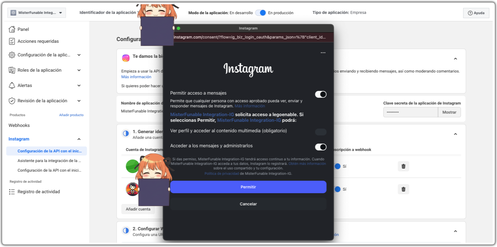
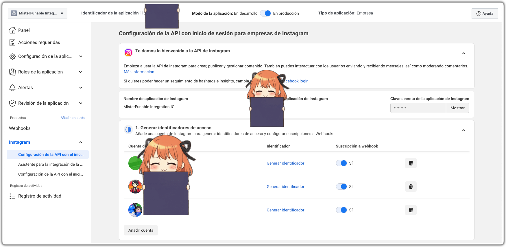

<!-- Source: https://funable.medium.com/adding-multiple-instagram-accounts-to-your-n8n-automation-772fd26af4a1 -->
<!-- Published: 2026-01-01T15:02:31 -->
# _Adding Multiple Instagram Accounts to Your n8n Automation_

Thanks to my canon event, I had to go multi-account.

<!-- Image Source: https://miro.medium.com/1*_rjnuHLV8UbBXyOqJzM2zg.png | Local: images/21/img-01.png -->

For better or worse, you can have multiple Instagram accounts associated with one "main" account. That's perfect for my purposes, but it does mean the "simple" workflow needs to be able to connect to those accounts.

If you want the previous posts in the series:

- [Getting Instagram Posts with n8n (The Simple Way Part 1)](https://medium.com/@mister.funable/getting-instagram-posts-with-n8n-the-simple-way-part-1-c66cb5217054)

- [Getting Instagram Posts with n8n (The Simple Way Part 2: The Final Part)](https://medium.com/@mister.funable/getting-instagram-posts-with-n8n-the-simple-way-part-2-the-final-part-fdad1e999d74)

---

## Adding New Accounts in Meta (Developer Portal)

At this point, you probably already have **one account** connected in the Instagram API setup screen inside the Meta Developer portal.

<!-- Image Source: https://miro.medium.com/1*rawSY-lHc1u1rXeE-uILDw.png | Local: images/21/img-02.png -->

To add another one, it's basically the same process again.

---

## Walkthrough

<!-- Image Source: https://miro.medium.com/1*_9DEIpUzVxWRYY-5Y0pd1g.png | Local: images/21/img-03.png -->

**Convert the new Instagram account to Business or Creator**

- I usually go **Creator** and pick something like **Blog** as the category.

**Add the account to your Meta app**

- Go to your Meta app → Instagram product → and look for the option that lets you **add/remove Instagram accounts** (the same one you used in Part 1).

**Log in**

- You can log in directly using the sub-account username + the main account password.

- After you've done it once or twice, Meta stops being dramatic and just gives you a menu where you can pick one of the associated accounts.

**It may "fail" the first time**

- This is the part that looks scary but is usually expected.

- Log in again and you'll get the actual permissions prompt for your app.

**Accept permissions**

- Once you accept them, the account shows up in the list.

<!-- Image Source: https://miro.medium.com/1*FlWXccJjBFJDzvV8F6JofQ.png | Local: images/21/img-04.png -->

Once done, you will see the account.

<!-- Image Source: https://miro.medium.com/1*2TlUECGVfowRQpFWc-lNKg.png | Local: images/21/img-05.png -->

---

## The Token

This sounds more complicated than it is.

It's the same Bearer auth you used in the curl from [Part 1](https://medium.com/@mister.funable/getting-instagram-posts-with-n8n-the-simple-way-part-1-c66cb5217054#:~:text=Step%202%3A%20Test%20Locally).

In the Meta / Instagram API config screen you'll see a button like **"Generate Identificator"**. Click it, copy the token, and that's what you use in n8n as your Bearer token.

So yeah, ignore the naming. It's just your **access token** (keep it secret).

---

## Practical n8n Approach

Create one n8n credential (token) per Instagram account.

This is not really optional in this setup, each account shows up with its own token in the Instagram API config screen.

If you overwrite the token, that's it. You're now pointing at the other account.

Then:

- Either duplicate the workflow per account (simple, boring, reliable)

- Or keep one workflow and loop through an "accounts" list (more elegant, more chances to break it at 2 AM)

---

## What's Next

This is the point where I pretend I'm going to properly "infrastructure as code" my n8n workflows... and then I don't.

But I do want a better way to version workflows than "random JSON files in a folder", so I'll eventually look into it.

But priority would do the same for YouTube... which will be a interesting thing to write about.
