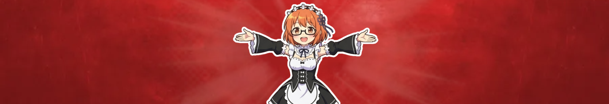

<!-- Source: https://funable.medium.com/from-zero-youtube-lessons-part-0-822bb8a9c883 -->
<!-- Published: 2026-01-03T14:56:44 -->
# From Zero - YouTube Lessons Part 0

### Moving On and Starting Over

My channel got removed, and I don't want this to be the "I peaked in high school" kind of post. I want to learn and reflect on everything that has happened. Yes, the views, the subscribers, and some videos are gone, but not everything is lost.

<!-- Image Source: https://miro.medium.com/1*alEoiJdHnI9WruKNwWZ9qA.png | Local: images/22/img-01.png -->

It's horrible. Not the channel removal itself, or that it's almost starting all over again. It's going through the first months of a new channel again. Slowwwww growth, but this time 5x worse.

I remember the first month, like one constant viewer 😂

> Moe: Ahora toquen, el público se impacienta.
Barney: ¡Queremos a los Chili Peppers! ¡Queremos a los Chili Peppers!

Being active in communities can help, but otherwise you depend a lot on the algorithm. That's something I'll cover later.

---

## What Hurts the Most

What hurts is that I have to go through my old videos, try not to cringe, and upload them again. Mainly 1/6 dolls and anime figure unboxings, which by my current standards (or depending on my mood), are not good enough. But they may be useful for others.

I aimed for stuff that was less likely to be covered and did it in my own style. That was the original reason for the channel: to see what I couldn't find elsewhere, without having to buy things just to find out if they were compatible between different 1/6 scale brands.

---

## What Helped Me Move On

Some people cared about it. They reached out and asked if I was going to come back. They said my content was useful for them. And that means the world, even if I had to cringe my way through re-uploading.

I started because I wanted to make the videos that I wanted to see, even if that risked the account. All while improving my photography, videography, and editing skills.

And it's fun!

---

## Why This Series Exists

Since I'm starting again on YouTube, I have some things to share.

I hit 1,000 subs about a year after creating the channel for dolls and anime figures, and it died out around 1,780 a few months later. So I have a few things that may be useful. Some are the same advice you find everywhere, plus my personal takes. Not the best performance overall, but decent experience compared to others.

Funny enough, I wasn't able to monetize it. I couldn't hit the quota of watch hours. I thought I reached 4,000+ and even received the notification, but YouTube delays and reports only the hours they consider valid. For reference, mine was actually around 2,900.

Doing what's considered "not technically 18+ but 18+" content is a little complicated. In most cases you won't be able to monetize regardless, since that type of content limits the advertisers, results in less revenue, and reduces views if you get shadow banned or strikes. That's why some channels that could be more explicit choose not to be. Sounds like cope, but that's why I stopped caring about monetization and focused on improving my skills. I take pride in that, though looking back, I cringe a lot.

But that's not all. I also have another channel where I occasionally upload references and memes to use at work. That one actually hit the YouTube milestones to be monetized, since it had better performance and some videos hit the right trends to get pushed by the algorithm.

And guess what? It got rejected since it's considered "low effort content." Fair enough. But I was able to glimpse the pains and joys of what it looks like to be monetizable. You can try again after a certain period, but I ain't going to give more love than necessary to that channel.

> **TL;DR**: That's why meme/anime channels start doing weird or longer content after a while and replace music. You can't live off the small stuff and copyright will negate all earnings if applies.

---

## What's Next

Next up, I want to cover the best advice I've picked up, impressions from my main channel, content tips, and quality of life stuff. I'll keep adding to this series as I remember more.
