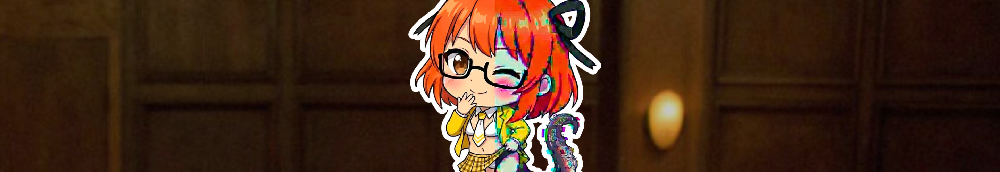
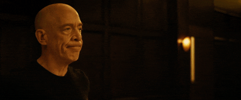
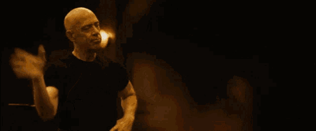
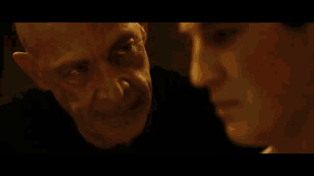
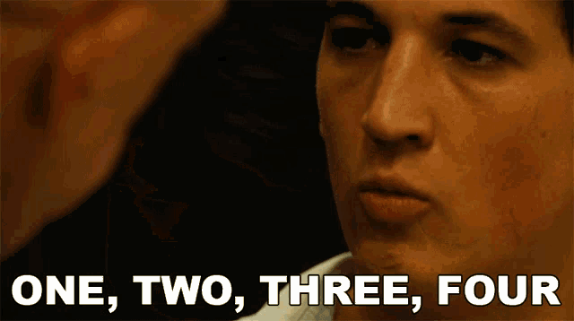
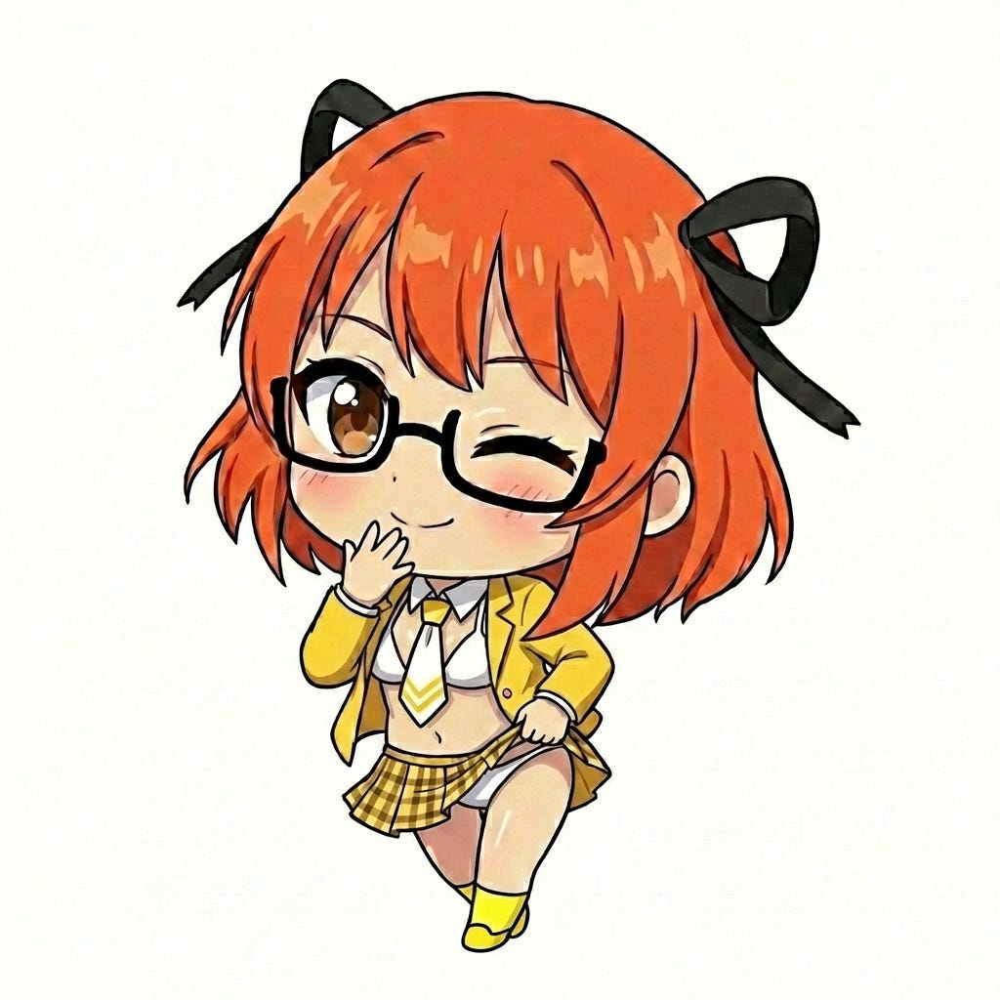
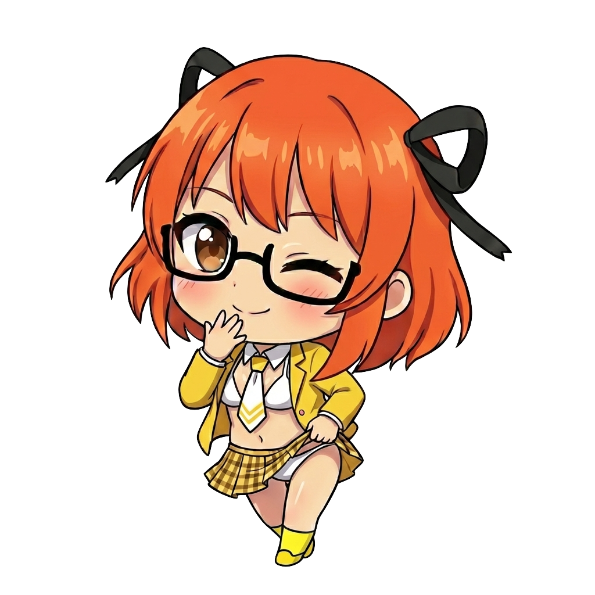

<!-- Source: https://funable.medium.com/why-your-ai-images-look-worse-after-each-iteration-b66abc24fced -->
<!-- Published: 2026-01-12T23:02:51 -->
# Why Your AI Images Look Worse After Each Iteration

### And What To Do About It

So I've been playing with AI image generation for a while now. And I've been facing something really annoying more and more: the more I iterated over an image with prompts, the worse it looked.

<!-- Image Source: https://miro.medium.com/1*pz_4F816o_fgKfhnnElM-g.png | Local: images/25/img-01.png -->


It was obvious that it was the AI and the iterations causing it, but I didn't know the name. And I didn't put much effort into googling beyond the first few results. Most of my searches just gave me stuff about hallucinations, which wasn't quite it.

So I did something different today. I asked Google AI for an answer rather than for an image (for a change of pace). And I finally got the name for this issue.

---

<!-- Image Source: https://miro.medium.com/1*xh_t6xg2qXYGeLSpuq-8Kw.gif | Local: images/25/img-02.gif -->


---

## The Problem: Generational Loss

Turns out, this has a name borrowed from analog media: **Generational Loss** (or **Iterative Degradation**).

Think of it like making a photocopy of a photocopy of a photocopy. Each copy loses a bit of quality. Eventually, you end up with a blurry mess.

In **AI terms**, here's what's happening:

1. The AI analyzes your image pixels

2. It compresses them into mathematical noise (latent space)

3. It re-imagines what that noise represents based on its training data

4. It outputs a "new" version

Every time it does this, it makes small guesses. Small errors. And when you feed that result back in, the AI mistakes its previous errors for intentional details and **amplifies them**. That's why your colors get saturated, your lines get thick, and everything starts looking "overdrawn."

Even though I'm using the Nanobana Pro model (which I really like), it still suffers from the same problem. And since I really like to refine and try things out, I run into this a lot.

---

<!-- Image Source: https://miro.medium.com/1*C1BtkgR0RosVGAV5jkkMXg.gif | Local: images/25/img-03.gif -->


---

## Why "Clean This Up" Makes It Worse

When you prompt the AI to "clear colors" or "make it look better," it often interprets this by:

- Cranking up contrast and saturation to make it "pop"

- Thickening lines to make them appear "sharper"

Which is... the opposite of what you wanted. The AI has a different definition of "better."

And there you have it: a correct answer but poor results.

---

<!-- Image Source: https://miro.medium.com/1*naWhAImfckEthrpYwicr-A.gif | Local: images/25/img-04.gif -->


---

## Better Prompts for Fixing Overdrawn and Oversaturated Images

To actually fix this, you can include specific stylistic instructions that steer the AI toward softness, precision, and balance.

Based on my current case, it would be something like this:

### Approach 1: The "Soft and Clean" Approach

**Best for:** Reducing saturation

> **Prompt:** A high-quality chibi illustration of this character. Soft pastel colors, 
balanced saturation, clean and thin line art, smooth gradients, gentle 
shading. No harsh contrast.

**Why it works:** Words like "soft," "pastel," and "gentle" directly counter high saturation. "Thin line art" fixes the overdrawn look.

### Approach 2: The "Professional Vector" Approach

**Best for:** Crispness without mess

> **Prompt:** Clean vector art style illustration of the character. Crisp and precise 
linework, flat colors with minimal cel-shading, bright but balanced color 
palette. Professional digital art, sharp focus.

**Why it works:** "Vector art" implies clean, mathematical precision rather than sketchy lines. "Flat colors" stops the AI from adding confusing shadow layers.

### Approach 3: The Negative Prompt Approach

**Best for:** When your AI tool supports it

> **Positive Prompt:** Cleaned up high-resolution anime illustration of the character.

> **Negative Prompt:** Oversaturated, high contrast, thick black lines, muddy colors, blurry, 
sketchy, harsh shadows.

**Why it works:** You're specifically forbidding the elements that caused the problem in the first place.

---

<!-- Image Source: https://miro.medium.com/1*TWKaQoe9PeLndDhOrFtghw.gif | Local: images/25/img-05.gif -->


---

## Recovering Already-Generated Images

<!-- Image Source: https://miro.medium.com/1*QA-2IhlQECjBaHRU62438A.jpeg | Local: images/25/img-06.jpg -->


<!-- Image Source: https://miro.medium.com/1*F1s-DY8cze6LNEXEJy6hZA.png | Local: images/25/img-07.png -->


If you've already gone through a few iterations and your image looks rough, here are some prompts to try to recover it:

**For oversaturated colors:**

```css
Reduce saturation, soft and muted color palette, natural lighting, 
no color boosting.
```

**For thick/messy lines:**

```scss
Refine linework, thin clean lines, precise outlines, reduce line weight, 
smooth edges.
```

**For general "overcooked" look:**

```css
Subtle refinements only, preserve original style, minimal changes, 
gentle cleanup, maintain original color balance.
```

The key is being explicit about what you DON'T want to change, not just what you want to fix.

---

<!-- Image Source: https://miro.medium.com/1*PUOm3VlCyXR1dmv3Gztl6Q.gif | Local: images/25/img-08.gif -->


---

## TL;DR

- **The problem:** Feeding AI images back into AI causes quality loss (Generational Loss)

- **Why:** The AI mistakes its own errors for intentional details and amplifies them

- **Fix:** Use specific prompts like "soft pastel colors" and "thin line art"

- **Avoid:** Vague prompts like "make it better" or "clean this up"

- **Negative prompts:** Explicitly ban "oversaturated, thick lines, harsh contrast"

And that's it! Hopefully this saves you some frustration. Also, this relates to the concept of **Model Collapse**, which is basically inbred models through models trained primarily on AI images. Something to think about.

Peace! ✌️
