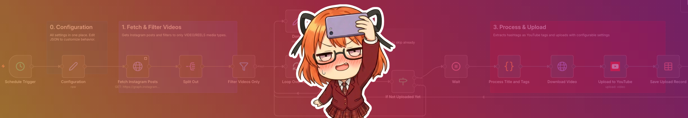

<!-- Source: https://funable.medium.com/uploading-instagram-videos-to-youtube-with-n8n-6df5ad3c2523 -->
<!-- Published: 2026-01-17T14:48:09 -->
# Uploading Instagram Videos to YouTube with n8n

After the Instagram to Twitter workflow, this one was kind of inevitable. Most of my latest content goes to Instagram first since I can adjust the colors more precisely on the phone. Then through n8n... why not automate the upload?

<!-- Image Source: https://miro.medium.com/1*_CkwrNqqlKqv48RllIuCyQ.png | Local: images/26/img-01.png -->


Most existing workflows use spreadsheets to handle scheduling. That's too cumbersome for me. I opted for a simpler approach: run at a certain time, pull a certain amount of videos, then add a delay between uploads so they're spaced out with a reasonable gap.

If you're new to the Instagram API setup, check [Part 1](https://medium.com/@mister.funable/getting-instagram-posts-with-n8n-the-simple-way-part-1-c66cb5217054) first.

---

## What This Workflow Does

1. Runs daily (or whenever you set it)

2. Fetches your latest Instagram posts

3. Filters to **only videos** (Reels included)

4. Checks a Data Table so it doesn't re-upload

5. Waits between uploads (configurable gap)

6. Extracts hashtags as YouTube tags

7. Uploads to YouTube with smart title truncation

8. Saves the record

Simple. Boring. Reliable.

---

## The Configuration Node

Everything lives in one JSON blob:

```json
{
  "includeSourceLink": false,
  "waitTimeoutSeconds": 900,
  "maxTitleLength": 100,
  "categoryId": "22",
  "privacyStatus": "public",
  "notifySubscribers": false,
  "defaultLanguage": "en",
  "ageRestricted": true
}
```

**Key settings:**

- **includeSourceLink**: Adds the Instagram permalink to the YouTube description. Set `false` if your channel isn't verified (external links get flagged).

- **waitTimeoutSeconds**: Gap between uploads. 900 = 15 minutes. YouTube doesn't love rapid-fire uploads.

- **ageRestricted**: Set `true` for 18+ content. This is the "made for kids" COPPA setting.

- **categoryId**: YouTube category. 22 = People & Blogs. See the table below.

## Category IDs

- 22: People & Blogs

- 24: Entertainment

- 20: Gaming

- 10: Music

---

## Setup Steps

### 1. Create the Data Table

In n8n: **Data Tables** → create one with two columns:

- `postId` (string) ← Instagram media ID

- `youtubeId` (string) ← YouTube video ID after upload

This is your "already uploaded" memory.

### 2. Set Your Instagram Credentials

In the **Fetch Instagram Posts** node, set your Bearer Auth credential (same token from Part 1).

### 3. Set Your YouTube Credentials

In the **Upload to YouTube** node, connect your YouTube OAuth2 credential.

If you haven't set up YouTube OAuth in n8n before: it's the standard Google OAuth dance. Create credentials in Google Cloud Console, enable the YouTube Data API v3, and add the OAuth consent screen.

### 4. Import and Activate

Paste the JSON into a new workflow, update the credentials, save, and activate.

---

## How the Title Works

The Code node does the heavy lifting:

1. Grabs the caption

2. Extracts text before the first hashtag → that's your title

3. If no text before hashtags, uses the first hashtag as the title

4. Truncates smartly at word boundaries (no cutting mid-word)

5. Pulls all hashtags as YouTube tags (max 10, cleaned up)

So if your Instagram caption is:

> _Check out this figure unboxing! #figma #anime #unboxing_

The YouTube title becomes: `Check out this figure unboxing!`

And the tags become: `#figma #anime #unboxing`

---

## Why the Wait Node?

To space out the publishing of videos. The workflow processes one video, waits (default 15 min), then moves to the next.

For testing, just use 1 second.

If you have 10 videos to upload, that's ~2.5 hours to upload them all. Slow but natural.

---

## Common Gotchas

- **"External links not allowed"**: Unverified channels can't add external links in descriptions. Set `includeSourceLink: false`.

- **OAuth token expired**: YouTube OAuth tokens expire. Re-authenticate in n8n if uploads fail.

- **Video too long**: Instagram Reels are usually under 90 seconds, so this rarely matters. But YouTube has its own limits for unverified channels.

- **Wrong category**: If your content keeps getting flagged, try a different `categoryId`.

---

## The Workflow JSON

I submitted it to n8n as a template but until I get some feedback on it. Here's the JSON in my `n8n-templates` repo:

- [Instagram to YouTube Workflow](https://github.com/MisterFunable/n8n-templates/blob/main/Upload%20from%20Instagram%20To%20YouTube/template-v2.json)

> **Edit**: the template was approved, available on the [n8n page](https://n8n.io/workflows/12773-batch-upload-instagram-reels-to-youtube-with-scheduled-delays/).

---

## What's Next

Trends... the last boss, at least of this season.

---

## Resources

- [Part 1: Getting Instagram Posts with n8n](https://medium.com/@mister.funable/getting-instagram-posts-with-n8n-the-simple-way-part-1-c66cb5217054)

- [Part 2: Posting to Twitter/X](https://medium.com/@mister.funable/getting-instagram-posts-with-n8n-the-simple-way-part-2-the-final-part-fdad1e999d74)

- [Adding Multi-Accounts](https://medium.com/@mister.funable/adding-instagram-multi-accounts-to-your-n8n-automation)

- [YouTube Data API v3](https://developers.google.com/youtube/v3)

- [n8n YouTube Node Docs](https://docs.n8n.io/integrations/builtin/app-nodes/n8n-nodes-base.youtube/)
