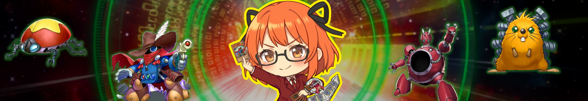

<!-- Source: https://funable.medium.com/side-notes-1-what-yu-gi-oh-taught-me-about-leadership-cd13634fbde7 -->
<!-- Published: 2026-01-23T00:49:49 -->
# Side Notes #1: What Yu-Gi-Oh Taught Me About Leadership

### _A series of random thoughts and perceptions_

<!-- Image Source: https://miro.medium.com/1*eGJPIOtrkhwJb5arn76_JQ.png | Local: images/27/img-01.png -->

I had a recent realization: making people "shine," as one of my clients put it, isn't actually that common.

And I think I learned how to do it playing Yu-Gi-Oh in high school.

So no, I wasn't wasting my life back then.

...Probably.

---

## The Ender's Game Baseline

It's not related to Yu-Gi-Oh! but I've internalized a quote from the Ender's Game books. It goes something like: "You are not better than your general."

(I haven't been able to pin down the quote, but probably it should be from Shadow saga, Bean's perspective. But I digress.)

**The point is**: you can be a great employee, but if your boss is driving toward a cliff, there's only so much you can do.

I value having the agency to decide how I handle tasks and projects. My aim is to simplify my work and the work of whoever I report to. And if I know the way forward, I'll make sure we take the optimal path.

---

## Development Arc

<!-- Image Source: https://miro.medium.com/1*MUAcqnYe9llYWZkRqvfGXQ.png | Local: images/27/img-02.png -->

I spent a lot of time on Yu-Gi-Oh. Looking back, like most things, it was a side quest to acquire something else. In this case, it was the mentality.

At that age, most of my skills weren't developed at all. I'd say I only started mentally coming online around 22, and by 25 I had real potency and leverage.

That's why I don't blame Fusion users. If you start with raw power, the optimal move is often to enter the field and get things done. Back then, for me, it was about working with scraps, assembling whatever I could, and finding a way to stay in the fight.

---

## Deck Building as Strategy

<!-- Image Source: https://miro.medium.com/1*AavqJ7TKgKah0-3auOAM2g.png | Local: images/27/img-03.png -->

Coming back to leadership, coordination, and strategy... from my standpoint, it's not that hard. There were personal challenges, sure. But when it comes to using resources, it's usually obvious what needs to be played.

What I noticed a few years ago, and again recently when I couldn't find the words to explain something to someone, is that the movements are so obvious it's painful to see. I ended up saying:

> It's like, you just need to remove a few copies of that card and the deck will run faster.

For those not fluent in Trading Card Games (TCGs), that's deck-building advice. But I realized I was unconsciously using that same mental framework.

**The idea is simple**: build a deck with a good variety of multi-purpose cards, and remove the ones that aren't worth drawing or are too specific. They might be useful. They might be cool. But most of the time, they're a poor draw, and a missed chance to play something better.

In some cases, that card even damages your own cards. And then what? Why would you do that to your deck, and to yourself?

Yes. It happens.

---

## People as Cards

<!-- Image Source: https://miro.medium.com/1*QjpR4hg7oVhugNvXMA4JkQ.png | Local: images/27/img-04.png -->

When you spend enough time around people, you start to notice patterns. Most have a default way of operating, a predictable set of strengths, and habits that repeat a little too often.
 As you interact more, you discover additional skills, preferences, and above all, conditions under which they work best.

Assigning someone a task that's far beyond their current scope and requires excessive setup is rarely a smart move. But when the conditions are right and the situation fits their strengths, things click. In those moments, people can contribute far more than they initially seem capable of.

Even when you can't unlock new skills right away, positioning still matters. The way people complement each other, the timing of their involvement, and how responsibilities are combined can make a significant difference.

Sometimes you don't get to choose the team or the timing. But if you can plan a few steps ahead, you can turn a difficult situation around by preparing the ground carefully.

That's the mentality behind Synchro Summoning.

---

## Summoning Philosophies

<!-- Image Source: https://miro.medium.com/1*4W5XhrH-z-KkiOkZoFWDXg.png | Local: images/27/img-05.png -->

I've never liked the mentality behind **Fusion Summoning**. To me, it feels like handholding. Impactful, sure, but most of the time it's a waste of resources and a loss of versatility.
 In practical terms, it's like a client expecting three Blue-Eyes White Dragons by fusing a high-level senior with a semi-senior. It might work, but you end up with a single outcome instead of two or three, after burning three resources to get there.

Now that I think about it, the real corporate style would be **Ritual Summoning**. All that structure, process, and ceremony just to get something on the field.

**Synchro Summoning** works differently. Smaller pieces combine into something bigger, with one element providing alignment and timing. Delta Accel Synchro follows the same logic, just scaled up. Bigger results, same principles.

That's the style I like. It feels more realistic. Small, well-timed efforts, aligned correctly, can produce outsized results. Not a single flashy move, but multiple configurations that let you respond, adapt, and stay versatile.

---

## Being a Tuner

<!-- Image Source: https://miro.medium.com/1*CgGGNbwq8-FQe7VhZFoX0w.png | Local: images/27/img-06.png -->

As a bit of an overshare, I've always identified strongly with **Quickdraw Synchron**. Partly because my deck revolved around it, but also because it became my mental model for speed, level awareness, and timing.

In that sense, I think of myself as a Tuner. Not as the main force, but as the element that helps things align. The role that enables larger outcomes by syncing well with others.

That perspective probably explains how I look at collaboration and teamwork. I focus on how different strengths can line up, how timing matters, and how coordination can unlock results that wouldn't exist otherwise.

At my current level, that tuning ability can feel overpowered. But it only exists because I didn't start with most of the foundational skills. I had to build them over time, leaning heavily on my ability to synchronize, adapt, and make things work together while I learned the rest.

---

## The Caveats

<!-- Image Source: https://youtu.be/z8YgTLZIpdw?si=ocvGPrriiNgMuA_w&t=70 | Local: images/27/img-07.html -->
](https://miro.medium.com/1*RCg3iH0QBrF_4kUGOFcZFQ.png)

Because I tend to think clearly and quickly, there's an obvious trap for someone like me: over-relying on myself to start every combo. You either burn yourself out, or if you're managing people, you burn your Tuners.

There are plenty of ways to address that. My current definition is this: it's like playing with a handicap for fun. You deliberately avoid One Turn Killing everything, let the game breathe, and allow situations to play out. You can still stop the game when you need to, and that's fine.

In tech, this looks less like going for an OTK and more like hitting damage quotas. Yes, with a good hand you _could_ end the game immediately. But you usually shouldn't. It's basically the meme where a junior says a project will take a week, and the senior says three months.

Another adjustment I've made is not needing to be the main Tuner anymore. I focus on arranging the table so the game runs smoothly. Worst case, I can always jump in, accelerate things, and tune directly. But that's the easy way out. There's a different game I'm enjoying right now, and I'll leave that story for another time.

To live a long life, some inner peace is required. Battles are fun, but some games are inevitably slow and predictable. That's often the best moment to let things level up naturally. After a while, if the rewards stop scaling, then you do what's necessary and nothing more.

---

## In Summary

<!-- Image Source: https://www.youtube.com/watch?v=kj3WS1pT18k | Local: images/27/img-08.html -->
**](https://miro.medium.com/1*4-a1WPY8jxFPJ4_ZD_jLng.png)

Yusei is the best Yu-Gi-Oh protagonist, and his ending is a solid illustration of everything I'm talking about here. Yes, getting a real job.

I wouldn't claim this is the perfect way to think about people or collaboration. But it _is_ an efficient one. It reduces mental overhead, skips unnecessary narrative, and focuses on how different strengths can combine in ways that benefit everyone involved.

At a leadership level, this translates into something simple: don't force outcomes, don't burn resources for the sake of speed, and don't confuse "can" with "should."

If you're hitting the quotas, keeping options in hand is often better than ending the game early or overworking yourself. Most of the time, there isn't much urgency. Some priorities exist just to get things rolling, and once you talk it through, that becomes clear.

And yes,

[CARD GAMES ON MOTORCYCLES!](https://youtu.be/jnJcen4Fohw?si=BDQ0p-Gep1dsaBKP)

Peace!
